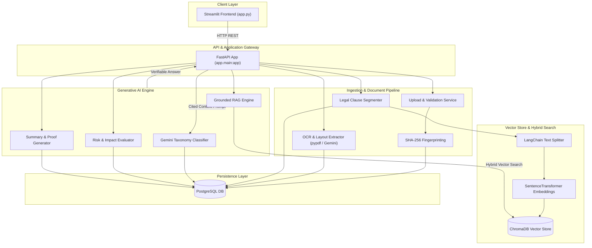

# LegalDoc AI — Contract Intelligence & Verification Platform

[](https://python.org)
[](https://fastapi.tiangolo.com)
[](https://postgresql.org)
[](https://trychroma.com)
[](https://langchain.com)
[](https://streamlit.io)

**LegalDoc AI** is an enterprise-grade legal document intelligence, contract verification, and risk assessment platform. Powered by **ChromaDB hybrid vector search**, **LangChain RAG architecture**, **SentenceTransformer embeddings**, and **Google Gemini**, the platform transforms unstructured legal contracts, leases, and agreements into structured, auditable, and verifiable insights.

---

## Key Capabilities

- **Executive Document Summary Report**: Automated synthesis of core terms, key points, critical dates/fees, user obligations, and rights with **expandable PDF verifiable proof citations** (exact verbatim quotes, clause IDs, and character spans).
- **Rule-Based Legal Clause Segmentation**: Parses document text into structured legal clauses preserving precise character boundary spans (`source_start` to `source_end`).
- **LangChain Overlapping Semantic Chunking**: Employs `RecursiveCharacterTextSplitter` to chunk legal text into dense units enriched with document metadata.
- **ChromaDB Local Vector Search**: Local vector store using `SentenceTransformers` (`all-MiniLM-L6-v2`) supporting **hybrid semantic search** (vector similarity + BM25 keyword matching).
- **Taxonomy Categorization & Risk Exposure Rubric**: Classifies clauses across 19 standard legal categories and scores contract risk exposure (`HIGH`, `MEDIUM`, `LOW`) with detailed **user impact explanations** and **suggested mitigations**.
- **Grounded Cited RAG Assistant**: Interactive inquiry assistant that retrieves relevant chunks from ChromaDB and returns grounded answers backed by verifiable source citations.

---

## Architecture Pipeline



---

## Technology Stack

| Layer | Technology | Purpose |
| :--- | :--- | :--- |
| **Frontend UI** | Streamlit | Clean, professional dark enterprise web interface |
| **Backend API** | FastAPI / Uvicorn | High-performance asynchronous REST API |
| **Language** | Python 3.14 | Modern Python execution runtime |
| **Relational Database**| PostgreSQL / SQLAlchemy / Alembic | Transactional system of record for documents, clauses, classifications, risks, and chat logs |
| **Vector Database** | ChromaDB | Local persistent vector index for dense semantic retrieval |
| **Embeddings** | SentenceTransformers | `all-MiniLM-L6-v2` embedding model |
| **Text Chunking** | LangChain (`RecursiveCharacterTextSplitter`) | Semantic overlapping chunking with rich metadata |
| **Generative LLM** | Google Gemini (`google-genai`) | Classification, risk evaluation, document summary, and grounded generation |
| **Document Processing**| PyPDF | Native PDF parsing and layout text extraction |
| **Package Manager** | Poetry | Dependency and virtual environment management |

---

## Detailed System Modules

### 1. Document Ingestion & Validation
- **SHA-256 Deduplication**: Generates unique cryptographic file hashes to detect duplicate uploads.
- **Format Verification**: Validates file magic bytes and MIME types for PDF, PNG, JPG, JPEG, and DOCX formats.

### 2. Legal Clause Segmentation & Chunking
- **Boundary Recognition**: Identifies numbered sections (`1.1`, `Section 2`, `Article III`), lettered sub-clauses (`(A)`, `(b)`), and legal headers (`TERMINATION`, `INDEMNIFICATION`, `RECITALS`).
- **LangChain Chunking**: Applies `RecursiveCharacterTextSplitter` (chunk size: 400, overlap: 80) preserving parent metadata:
  ```json
  {
    "document_id": "doc-uuid",
    "clause_id": "doc-uuid-clause-0003",
    "heading": "Termination Notice",
    "source_start": 2450,
    "source_end": 3120,
    "chunk_index": 1
  }
  ```

### 3. ChromaDB Hybrid Vector Search
- **Persistent Storage**: Stores embeddings locally in `.chroma_db`.
- **Hybrid Retrieval**: Combines cosine vector similarity search with BM25 keyword matching to retrieve relevant contract chunks for user queries.

### 4. Executive Summary with Verifiable PDF Proof
- Generates an executive summary containing **Core Provisions**, **Critical Dates & Fees**, **Contractual Obligations**, and **Contractual Rights**.
- Every item includes a `VerifiedSummaryItem`:
  - `statement`: Summary of the contractual point.
  - `clause_id`: Source clause identifier.
  - `source_location`: Character offsets in PDF (`chars 450–890`).
  - `verbatim_proof`: **Exact verbatim sentence quoted directly from the original document** for complete verification.

### 5. Contractual Risk & User Impact Assessment
- Scores clause risk level (`HIGH`, `MEDIUM`, `LOW`) and percentage score.
- Categorizes risk flags (`UNFAIR_TERM`, `ONE_SIDED`, `AMBIGUOUS`, `FAIR`).
- Outlines **Potential User Impact** (consequences of the risk) and **Mitigation Recommendations**.

---

## Directory Structure

```text
Document-Verification-AI/
├── backend/
│   ├── app/
│   │   ├── api/                  # FastAPI router endpoints
│   │   │   ├── upload.py         # File upload & validation
│   │   │   ├── ocr.py            # Text extraction routes
│   │   │   ├── clauses.py        # Segmentation routes
│   │   │   ├── classification.py # Legal taxonomy routes
│   │   │   ├── risk.py           # Risk dashboard routes
│   │   │   ├── explanation.py    # Summary & proof routes
│   │   │   └── chat.py           # RAG chatbot routes
│   │   ├── config/               # Settings & environment variables
│   │   ├── database/             # SQLAlchemy base & session setup
│   │   ├── models/               # ORM database models
│   │   ├── repositories/         # Repository pattern database access
│   │   ├── schemas/              # Pydantic validation schemas
│   │   └── services/             # Core business logic & AI engines
│   │       ├── vector_store_service.py # ChromaDB & LangChain chunking
│   │       ├── embedding_service.py    # Hybrid search service
│   │       ├── rag_service.py          # Grounded RAG chatbot engine
│   │       ├── gemini_explainer.py     # Summary & proof synthesis
│   │       ├── explanation_service.py  # Summary report service
│   │       ├── risk_evaluator.py       # Risk scoring engine
│   │       └── risk_service.py         # Risk dashboard service
│   └── tests/                    # Pytest test suite (110 tests)
├── frontend/
│   └── app.py                    # Streamlit web application
├── pyproject.toml                # Poetry dependencies
└── README.md                     # Documentation
```

---

## API Endpoint Reference

### Document Management
- `POST /api/v1/documents/upload` — Upload file & compute SHA-256 fingerprint
- `POST /api/v1/documents/{document_id}/ocr` — Execute OCR text extraction
- `POST /api/v1/documents/{document_id}/clauses/segment` — Segment document into legal clauses
- `GET /api/v1/documents/{document_id}/clauses` — List segmented document clauses

### Analysis & Summary
- `POST /api/v1/documents/{document_id}/classify` — Classify clauses into 19 legal categories
- `POST /api/v1/documents/{document_id}/score-risk` — Evaluate clause risk exposure & user impact
- `GET /api/v1/documents/{document_id}/risk-dashboard` — Fetch complete document risk dashboard
- `POST /api/v1/documents/{document_id}/explain` — Generate plain-language clause explanations
- `GET /api/v1/documents/{document_id}/summary` — Fetch Executive Document Summary Report with PDF proof citations

### Grounded RAG Chatbot
- `POST /api/v1/documents/{document_id}/chat` — Query document using ChromaDB hybrid RAG
- `GET /api/v1/documents/{document_id}/chat-history` — Fetch conversation message history

---

## Installation & Setup Guide

### 1. Prerequisites
- **Python**: `>=3.14`
- **PostgreSQL**: Running locally on port `5432` with database `legal_ai`
- **Poetry**: Package manager installed (`pip install poetry`)
- **Google Gemini API Key**: Set in environment variable `GEMINI_API_KEY`

### 2. Environment Setup
Create a `.env` file in the project root:
```env
GEMINI_API_KEY=your_google_gemini_api_key
DATABASE_HOST=localhost
DATABASE_PORT=5432
DATABASE_NAME=legal_ai
DATABASE_USER=postgres
DATABASE_PASSWORD=postgres
```

### 3. Install Dependencies
```powershell
poetry install
```

### 4. Database Migration
```powershell
poetry run alembic upgrade head
```

### 5. Running the Backend API
In terminal 1:
```powershell
poetry run uvicorn app.main:app --reload --app-dir backend
```
FastAPI API Docs will be available at: `http://localhost:8000/docs`

### 6. Running the Streamlit Frontend
In terminal 2:
```powershell
poetry run streamlit run frontend/app.py
```
Streamlit App will open at: `http://localhost:8501`

---

## Automated Test Suite

Run the full automated test suite using Pytest:
```powershell
poetry run pytest -v
```

> [!NOTE]
> The test suite includes 110 automated unit and integration tests covering API endpoints, clause segmenters, vector search, risk evaluators, and repository models.

---

## Legal & Compliance Disclaimer

> [!IMPORTANT]
> **Informational Purpose Only**: LegalDoc AI provides automated document parsing, classification, summary synthesis, and risk scoring for informational purposes only. It does not constitute formal legal advice, representation, or legal opinion. Users should verify all extracted claims against original documents and consult qualified legal counsel for binding advice.
