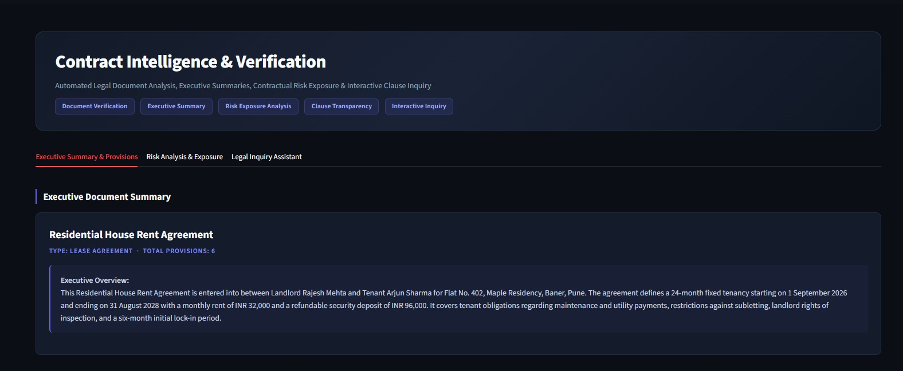
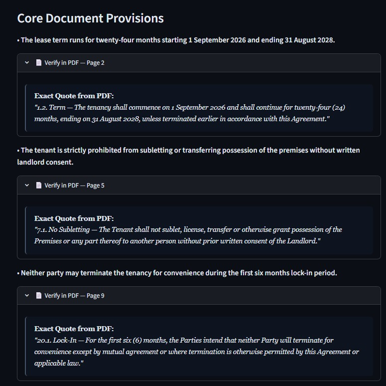
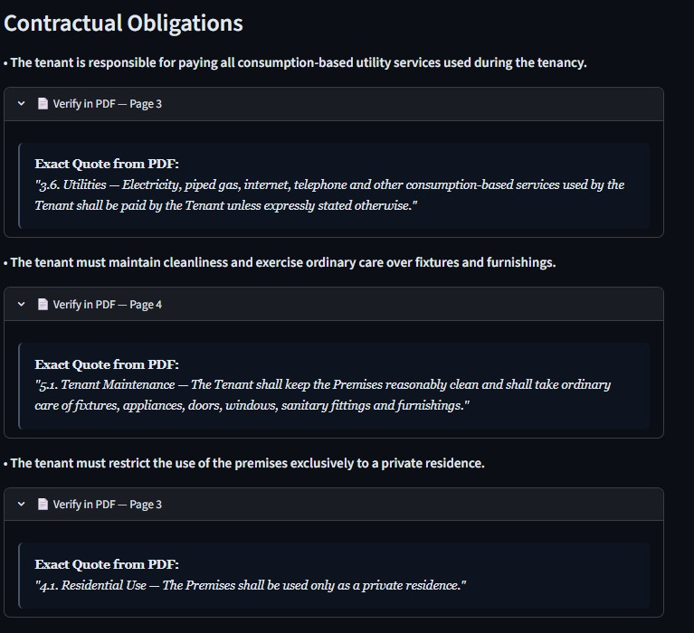
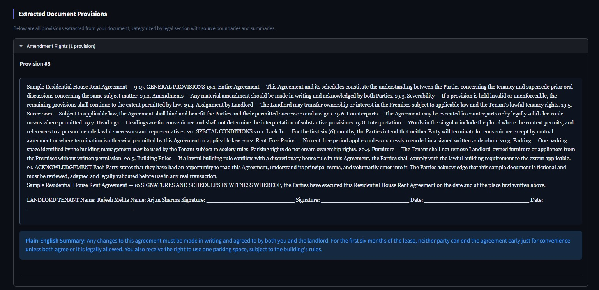
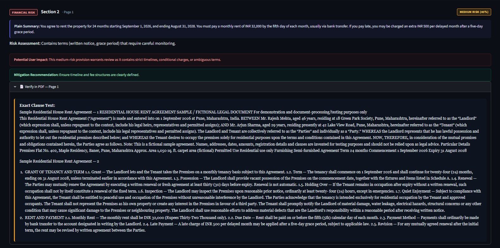
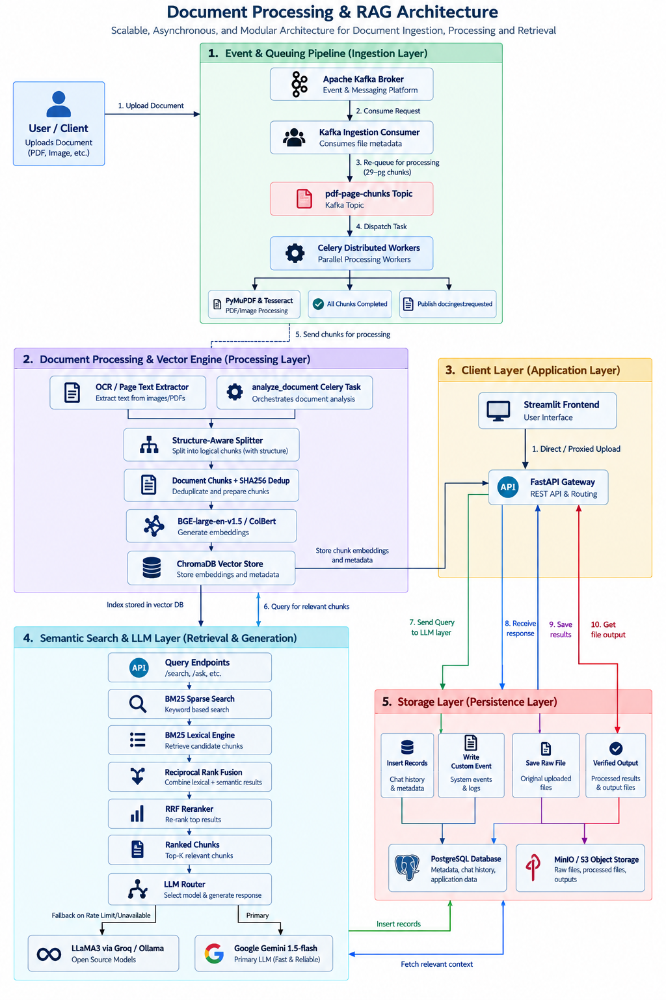
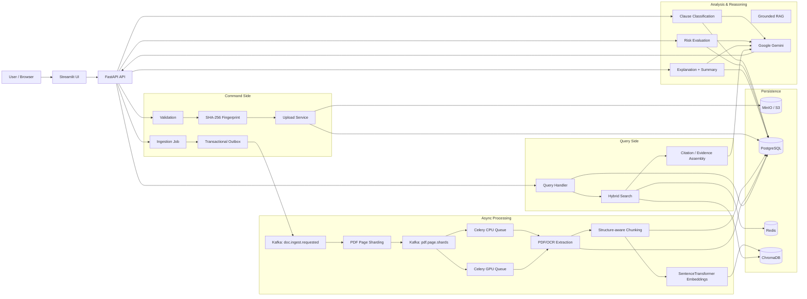

# LegalDoc AI — Production-Grade Document Verification & Contract Intelligence

[](https://www.python.org/)
[](https://fastapi.tiangolo.com/)
[](https://www.postgresql.org/)
[](https://www.trychroma.com/)
[](https://redis.io/)
[](https://kafka.apache.org/)
[](https://docs.celeryq.dev/)
[](https://min.io/)
[](https://www.langchain.com/)
[](https://streamlit.io/)

**LegalDoc AI** is a document intelligence platform for contracts and legal documents. It combines deterministic document validation, SHA-256 content fingerprinting, object storage, asynchronous ingestion, structure-aware clause segmentation, semantic + lexical retrieval, grounded RAG, clause classification, risk scoring, explanations, and auditable source citations.

The project is designed around a production-minded separation of concerns:

- **Command path**: accepts documents, validates them, stores them, creates ingestion jobs, and publishes asynchronous work.
- **Query path**: reads document state, retrieved clauses, classifications, risk results, summaries, chat history, and RAG evidence.
- **Heavy processing path**: Kafka + Celery distribute expensive PDF/OCR/chunking/embedding work outside the API request path.
- **Persistence path**: PostgreSQL stores transactional metadata; MinIO/S3 stores the raw documents; ChromaDB stores embeddings and vector metadata; Redis provides low-latency cache/dedup services.


---

## Why this is more useful than a general-purpose chatbot

A general chatbot starts from a language model and may answer from model knowledge or whatever context is supplied in a prompt. LegalDoc AI is designed around a stronger trust boundary: **the uploaded document is the source of truth**.

| Capability | General chatbot | LegalDoc AI |
|---|---|---|
| Document validation | Usually external to the chat model | Extension + MIME + magic-byte validation |
| Duplicate upload detection | Usually absent | SHA-256 fingerprint + unique DB constraint |
| Large-document processing | Often synchronous/manual | Kafka events + page sharding + Celery workers |
| Exact source locations | Usually absent | Clause/source spans and citation metadata |
| Contract clause structure | Generic text understanding | Dedicated clause segmentation |
| Retrieval | General semantic context | Document-scoped hybrid semantic + BM25-style retrieval |
| Risk analysis | Prompt-dependent | Dedicated classification/risk/explanation services |
| Raw file persistence | Platform-specific | MinIO/S3-compatible object storage |
| Operational persistence | Conversation-centric | PostgreSQL document/job/analysis/chat records |
| Traceability | Variable | Clause IDs, source spans, quoted evidence |
| Duplicate processing avoidance | Usually absent | File/chunk hashes and Redis dedup cache |
| Async workload isolation | Usually absent | Kafka + Celery CPU/GPU queues |

The result is closer to a **document verification and evidence retrieval system with a conversational interface** than to a generic chat application.

---

# Product UI & Working Features

LegalDoc AI is not only a backend ingestion pipeline; the Streamlit application exposes the analysis results as a verification-oriented workspace. The UI is structured around **evidence, explainability, and source traceability** rather than a chat-only interface.

## End-to-end UI flow

```text
Upload document
      ↓
Document validation + SHA-256 fingerprint
      ↓
Asynchronous ingestion
(Kafka → page sharding → Celery workers)
      ↓
PDF/OCR extraction → structure-aware chunking → embeddings
      ↓
ChromaDB + PostgreSQL persistence
      ↓
──────────────────────────────────────────────
Streamlit analysis workspace
  • Executive summary
  • Core provisions + exact PDF evidence
  • Contractual obligations
  • Extracted provisions + plain-English explanations
  • Risk analysis + mitigation guidance
  • Document-scoped legal inquiry / RAG
──────────────────────────────────────────────
```

## 1. Executive Summary dashboard



The summary view gives the user a high-level interpretation before they inspect individual clauses. The screenshot shows:

| UI element | What it communicates |
|---|---|
| Document title and type | Identifies the analysed contract and its document category |
| Total provisions | Shows how many provisions were extracted for the document |
| Executive overview | Condenses the agreement into a readable business/legal overview |
| Top navigation tabs | Separates summary, risk analysis, and legal inquiry workflows |

This view is backed by the document-summary output described in the analysis pipeline and is intended to avoid forcing the user to read a long contract before understanding its key terms.

## 2. Core provisions with source verification



The core-provisions view is designed around **verification rather than unsupported summarization**. Each important provision is paired with an expandable source reference containing an exact quote from the PDF and the originating page number.

The screenshot demonstrates:

- provision-level summaries written in plain language;
- `Verify in PDF — Page N` source anchors;
- exact quoted clause text;
- separate evidence blocks for multiple provisions.

This directly reflects the repository's source-span/citation design: retrieved or analysed content retains document location metadata so the user can trace an interpretation back to the original contract.

## 3. Contractual obligations view



The obligations section converts contract language into actionable obligations. In the screenshot, the system presents tenant responsibilities and then exposes the supporting PDF language underneath each item.

This makes the distinction between **interpretation** and **evidence** explicit:

```text
Plain-language obligation
        ↓
Source page reference
        ↓
Exact quote from the contract
```

Typical outputs visible in this view include payment responsibilities, maintenance duties, and permitted-use restrictions.

## 4. Extracted document provisions



The extracted-provisions screen exposes the underlying clause inventory instead of only showing a high-level summary. The screenshot shows a categorized provision, the extracted source text, and a generated plain-English explanation.

This view is useful for auditing the extraction pipeline because the user can inspect:

- the legal section/category assigned to a provision;
- the original extracted clause text;
- the system-generated plain-English summary;
- the relationship between the structured analysis and the source document.

The repository's clause segmentation and analysis services preserve structured clause records separately from generated explanations, which allows the UI to display these artifacts without regenerating them on every page load.

## 5. Risk analysis and exposure



The risk view moves beyond extraction into a structured assessment workflow. The screenshot shows a risk-labelled section containing a score, a plain-language summary, a risk assessment, potential user impact, a mitigation recommendation, and the supporting clause text.

The current analysis model exposes these result types:

| Risk output | Purpose |
|---|---|
| Risk level / score | Communicates severity in a compact form |
| Plain summary | Explains the provision in non-legal language |
| Risk assessment | Describes why the provision may require attention |
| Potential user impact | Highlights the practical consequence |
| Mitigation recommendation | Suggests what should be reviewed or clarified |
| PDF verification | Preserves the supporting source text and page |

This is consistent with the repository's risk-analysis pipeline, which stores structured risk outputs so the dashboard can render them without re-running the model for every page request.

## 6. Navigation model

The UI is intentionally divided into three major workflows visible in the screenshots:

```text
Executive Summary & Provisions
            │
            ├── Understand the contract
            ├── Inspect important provisions
            └── Verify source evidence

Risk Analysis & Exposure
            │
            ├── Identify potentially risky terms
            ├── Understand user impact
            └── Review mitigation guidance

Legal Inquiry Assistant
            │
            ├── Ask document-scoped questions
            ├── Retrieve relevant evidence
            └── Generate grounded answers with citations
```

The third workflow maps to the repository's RAG query path: document-scoped retrieval, hybrid search, ranked evidence selection, grounded prompting, and structured response generation.

## UI design principles

The current interface follows five practical principles:

1. **Evidence first** — important claims can be expanded to reveal the source quote.
2. **Progressive disclosure** — summaries appear first; detailed clauses and evidence are available on demand.
3. **Separation of concerns** — summary, risk, obligations, extraction, and inquiry have distinct surfaces.
4. **Auditability** — page references and exact quoted text remain visible alongside interpretations.
5. **LLM output is not treated as the source of truth** — the uploaded document and retrieved evidence remain the grounding boundary.

> **Implementation status:** the screenshots demonstrate the current Streamlit presentation layer. The backend capabilities documented elsewhere in this README describe the implemented services and processing pipeline; features listed as production-roadmap items are intentionally not presented as completed here.

---

# Architecture at a Glance



The architecture separates the system into ingestion, processing/vector storage, client/UI, retrieval/generation, and persistence responsibilities. The important design boundary is that large-document processing happens asynchronously while the UI reads persisted analysis artifacts and requests document-scoped retrieval when the user asks questions.

The detailed Mermaid architecture and request-to-response flows remain below for engineers who want the implementation-level view.

---

# Full Production Architecture



## Request-to-response flow

### Upload / ingestion

```text
User uploads PDF
      |
      v
FastAPI command endpoint
      |
      +--> filename / extension validation
      +--> MIME validation
      +--> magic-byte validation
      +--> size validation
      |
      v
SHA-256 fingerprint
      |
      +--> existing hash? ---- yes ---> reuse existing document/job
      |
      no
      |
      v
MinIO / S3 object storage
      |
      v
PostgreSQL document metadata
      |
      v
IngestionJob + OutboxEvent
      |
      v
Kafka: doc.ingest.requested
      |
      v
PDF metadata + page count
      |
      v
Page shards (default 50 pages/shard)
      |
      +-----------> Kafka: pdf.page.shards
      |                         |
      |                    Celery queues
      |                  /              \
      |              CPU workers      GPU workers
      |                 |                  |
      |                 +------ OCR -------+
      |                          |
      v                          v
      page text / OCR output --> chunking --> embeddings --> ChromaDB
                                      |
                                      +--> PostgreSQL clause/analysis state
```

### Query / chatbot

```text
User question
      |
      v
FastAPI query endpoint
      |
      v
Document scoped query handler
      |
      +--> PostgreSQL: document + clauses
      |
      +--> Redis: cached query embeddings / reusable query data
      |
      +--> ChromaDB: dense retrieval
      |
      +--> BM25-style lexical retrieval
      |
      v
Reciprocal Rank Fusion (RRF)
      |
      v
Light lexical reranking / overlap bonus
      |
      v
Top-K evidence chunks
      |
      v
Grounded prompt with clause IDs + source spans
      |
      v
Gemini structured JSON response
      |
      +--> answer
      +--> confidence
      +--> citations
      |
      v
PostgreSQL chat history + API response
```

---

# Technology Stack and Why Each Layer Exists

| Layer | Technology | Role in the system | Production value |
|---|---|---|---|
| UI | Streamlit | Document upload, inspection, risk/summary views, chat | Fast internal/product UI iteration |
| API | FastAPI + Uvicorn | REST API and dependency-injected DB sessions | Clear service boundary and scalable stateless API workers |
| Language | Python 3.14 | Application runtime | Common ecosystem for AI, OCR, data and backend services |
| Relational store | PostgreSQL + SQLAlchemy + Alembic | Documents, ingestion jobs, page-shard state, clauses, classifications, risk, explanations, chat | ACID state, indexes, relational joins, migrations |
| Object store | MinIO / S3 API | Raw file storage | Keeps large binaries out of PostgreSQL and supports presigned upload/download patterns |
| Vector DB | ChromaDB | Dense embeddings + metadata | Efficient semantic retrieval without scanning full document text |
| Cache / dedup | Redis | Chunk dedup and query-embedding cache | Avoids repeated CPU/model work and reduces latency |
| Event streaming | Kafka | Durable ingestion events and page-shard events | Decouples API traffic from heavy processing |
| Task execution | Celery | CPU/GPU worker dispatch and retries | Isolates expensive OCR/chunking/indexing from API latency |
| Chunking | LangChain text splitters | Recursive token-aware/character-aware chunking | Controls context size and retrieval granularity |
| Embeddings | SentenceTransformers (`BAAI/bge-large-en-v1.5`) | Dense vector representation | Semantic similarity for paraphrased legal language |
| LLM | Google Gemini | Classification, risk, explanation, summary and grounded answer generation | Natural-language reasoning over retrieved evidence |
| PDF processing | PyPDF + PyMuPDF | PDF metadata/text/page processing | Native text extraction and page-aware processing |
| Tests | Pytest | Unit and service/API coverage | Regression safety |
| Packaging | Poetry | Dependencies and environment | Reproducible project setup |
| Deployment | Docker Compose / Render config | Local multi-service topology and web deployment configuration | Repeatable environment setup |

---

# Command Query Responsibility Segregation (CQRS)

The repository contains separate command and query handlers under `backend/app/cqrs/`.

## Command side

`DocumentCommandHandler` is responsible for state-changing operations:

- upload the document
- create or reuse ingestion jobs
- publish ingestion events
- trigger OCR/segmentation/classification/risk/explanation flows
- initiate document chat operations

The command side is intentionally write-oriented. A document upload should not wait for OCR, chunking, embedding, classification and explanation before acknowledging the request.

## Query side

`DocumentQueryHandler` is responsible for read-oriented operations:

- fetch document metadata
- paginate clauses
- fetch chat history
- fetch classifications
- fetch risk dashboard
- fetch explanations
- fetch document summary
- search relevant document evidence

## Why CQRS helps in production

The dominant workload characteristics are different:

```text
COMMAND / INGESTION                         QUERY / RETRIEVAL
-------------------                         ------------------
large files                                small requests
CPU-heavy parsing                           low-latency reads
OCR                                         vector lookup
embedding generation                       filtering / ranking
LLM analysis                                answer generation
retries                                     high request concurrency
```

CQRS lets these paths scale independently. API/read instances can remain lightweight while worker capacity is increased for ingestion bursts.

### Important architectural clarification

CQRS does **not** require two unrelated databases. In this implementation, CQRS is primarily a **separation of command and query responsibilities**. PostgreSQL remains the transactional source of truth while ChromaDB is used for vector retrieval. At larger scale, read models or a dedicated pgvector/read cluster could be introduced without changing the API contract.

---

# Large PDF Ingestion Pipeline

Large PDFs are one of the main reasons this architecture is asynchronous.

## 1. Validate before processing

The validation layer checks:

- supported extension
- supported MIME type
- extension/MIME consistency
- maximum file size
- file magic bytes/signature

The current default maximum is configured through `MAX_UPLOAD_SIZE_MB`.

## 2. Hash before expensive processing

The upload path computes SHA-256 in **1 MB streaming reads**. This avoids loading the entire upload into application memory solely to identify it.

The resulting hash is stored in PostgreSQL as a unique indexed field.

## 3. Store binaries outside PostgreSQL

The raw PDF is stored in MinIO/S3-compatible object storage under an object key such as:

```text
documents/raw/<document-uuid>.pdf
```

PostgreSQL stores metadata and the object key, not the full binary document.

## 4. Create an asynchronous ingestion job

The command side creates:

- `IngestionJob`
- `OutboxEvent`

and publishes `DocumentIngestRequested` to Kafka.

## 5. Page-level sharding

`PdfShardingService` determines PDF page count and creates page shard records. The default configuration is:

```text
PDF_SHARD_SIZE_PAGES = 50
```

A 400-page document therefore becomes roughly:

```text
400 pages -> 8 logical page shards
```

The exact number is `ceil(page_count / shard_size)`.

Each shard tracks:

- shard index
- page start/end
- processing status
- retry count
- error message

This gives the system resumability and much smaller units of work than processing the entire PDF as one job.

## 6. CPU/GPU specialization

The ingestion architecture distinguishes processing pools:

- **CPU queue**: native-text PDF and general document processing
- **GPU queue**: scanned/image-heavy OCR workloads

A CPU worker inspects PDF text extraction. If pages have no extractable text, the design can reroute scanned PDF processing to the GPU/OCR path.

## 7. Chunking only after page extraction

For shard processing, the current implementation uses LangChain's token-aware recursive splitter with approximately:

```text
chunk_size   = 900
chunk_overlap = 120
```

The service also preserves:

- document ID
- shard index
- page number
- section title
- chunk hash
- chunk ID

That metadata is what allows the retrieval layer to map semantic evidence back to a concrete document location.

---

# Kafka + Sharding + Celery + Redis: Why These Components Work Together

These technologies solve different problems and should not be treated as interchangeable.

## Kafka — event durability and decoupling

Current Kafka topics include:

```text
doc.ingest.requested
pdf.page.shards
pdf.page.shards.dlq
```

Kafka's job is to move **events**, not to run CPU-heavy OCR itself.

Example event:

```json
{
  "document_id": "...",
  "object_key": "documents/raw/...pdf",
  "filename": "contract.pdf",
  "content_type": "application/pdf",
  "file_size": 12345678,
  "sha256": "...",
  "processing_pool": "cpu"
}
```

### Production benefit

If 100 users upload documents at once, FastAPI does not need 100 synchronous OCR pipelines. It acknowledges the command and Kafka absorbs the workload burst while workers consume at their own processing rate.

## PDF sharding — divide expensive work

Sharding changes:

```text
one 500-page job
```

into:

```text
10 x 50-page jobs
```

That means a failed shard can be retried without reparsing the other 450 pages.

## Celery — actual execution

Celery is the work executor. The current worker configuration includes:

```text
CPU queue -> concurrency 4
GPU queue -> concurrency 1
```

The Celery app is configured with:

- late acknowledgements
- prefetch multiplier = 1
- started-task tracking
- startup broker retry
- exponential retry/backoff configuration on shard tasks

This matters for CPU-heavy jobs because a worker should not aggressively reserve many long-running tasks while another worker sits idle.

## Redis — low-latency state, not the system of record

Redis is used for:

1. **Chunk deduplication** via `SET ... NX`
2. **Query embedding cache** keyed by SHA-256 of the normalized query string
3. General JSON cache helpers

PostgreSQL remains the durable state store. Redis is an optimization layer.

---

# Hashing: Integrity, Deduplication, Cache Keys, and Cost Control

The project uses **SHA-256**, but its role must be described correctly.

## Document hashing

The original file is streamed through SHA-256:

```text
PDF bytes
   |
   v
SHA-256
   |
   v
64-character fingerprint
```

The fingerprint is stored in PostgreSQL with a unique constraint.

That allows:

```text
same bytes -> same hash -> existing document can be reused
```

### Why this reduces cost

Without content-level deduplication, repeated uploads could cause repeated:

- object-storage writes
- OCR
- clause segmentation
- embedding generation
- vector upserts
- LLM analysis

With hash-based deduplication, the system can detect an exact byte-identical document before these expensive stages.

## Chunk hashing

Chunks are normalized and hashed before indexing. A chunk ID includes a short hash prefix, and Redis can record previously seen chunk hashes.

This reduces duplicate embedding work when the same normalized chunk is encountered again.

## Query embedding cache

For repeated questions, Redis uses:

```text
SHA-256(query text) -> cached embedding
```

The embedding itself is cached, not the raw query text as the key.

This avoids repeatedly running the embedding model for identical query strings.

## Security clarification

**SHA-256 is not encryption.** A hash does not make the PDF contents unreadable. Document confidentiality comes from controls such as:

- TLS for transport
- authenticated API access
- object-storage access controls
- encryption at rest
- tenant/document authorization
- secret management
- retention/deletion policies
- audit logging

The current repository implements strong upload validation, hashing, object storage, and metadata separation, but a full multi-tenant security boundary requires explicit authentication/authorization and tenant-aware access rules at deployment time.

---

# Hybrid Search and Retrieval Cost Optimization

Legal documents contain both semantic concepts and exact legal terminology. Relying only on dense vectors can miss literal terms, identifiers, section names or exact phrases. Relying only on keywords can miss paraphrases.

LegalDoc AI therefore uses a hybrid path.

## Dense retrieval

The system uses SentenceTransformers to encode document chunks and user queries.

The current configured embedding model is:

```text
BAAI/bge-large-en-v1.5
```

ChromaDB stores the resulting vectors with document-level metadata filtering.

## Sparse retrieval

The implementation also contains a lightweight BM25-style lexical scorer:

- term frequency
- document frequency
- inverse document frequency
- document length normalization

This provides lexical evidence without a second external search service.

## Reciprocal Rank Fusion

Dense and sparse result lists are combined with **RRF** instead of assuming that raw vector scores and lexical scores are directly comparable.

Conceptually:

```text
Dense ranking       Sparse ranking
     |                    |
     +---------+----------+
               |
               v
        Reciprocal Rank Fusion
               |
               v
         overlap reranking
               |
               v
             Top-K
```

## Final reranking

A small lexical overlap bonus is applied after fusion. This is intentionally much cheaper than invoking a large LLM reranker for every retrieved chunk.

### Why this saves cost

The expensive model is used only after retrieval has reduced the document to a small evidence set:

```text
Entire 500-page PDF
       |
       v
page/chunk index
       |
       v
dense + sparse retrieval
       |
       v
Top-K evidence chunks
       |
       v
LLM generation
```

The model therefore does not need the entire contract in its context window.

---

# RAG Reasoning Flow

The RAG layer is deliberately grounded rather than open-ended.

## Stage 1 — identify the document boundary

The query is always associated with a `document_id`. Retrieval is filtered to that document, preventing unrelated contracts from becoming evidence for the answer.

## Stage 2 — retrieve evidence

The system retrieves relevant chunks from the document using:

```text
dense similarity + lexical BM25-style score -> RRF -> lightweight rerank
```

## Stage 3 — construct an evidence prompt

The prompt contains:

- clause ID
- heading when available
- source span
- retrieved text

Example structure:

```text
--- Clause ID: ... (span: 4500-5120) ---
The tenant shall provide written notice...
```

## Stage 4 — constrain generation

Gemini is instructed to:

1. answer only from supplied clauses
2. cite clause IDs and source spans
3. say explicitly when the context is insufficient
4. return a structured response

The response schema contains:

```text
answer
confidence
citations[]
```

## Stage 5 — persist the result

User and assistant messages, citations and confidence are stored in PostgreSQL so the application can reconstruct the conversation and evidence trail.

---

# Cross-Question / Conversational Behavior

The project already persists chat history and exposes a chat-history endpoint. This is useful for UI continuity and auditability.

However, an important implementation detail is that the current RAG generation function receives the **current query plus retrieved document evidence**; prior chat turns are persisted but are not currently injected into the Gemini grounding prompt.

That means true conversational coreference such as:

```text
Q1: What is the termination notice?
A1: 30 days.

Q2: Does that apply to the tenant too?
```

should be upgraded to an explicit conversational query-rewrite step in a hardened production version:

```text
chat history
    |
    v
query / intent rewrite
    |
    v
standalone retrieval query
    |
    v
hybrid document search
    |
    v
retrieved evidence
    |
    v
answer generation
```

This is preferable to simply dumping the full conversation into the prompt because the history can be summarized or selectively windowed while the retrieval query remains document-grounded.

---

# Document Verification and Legal Analysis Pipeline

The system is not only a chatbot. It produces structured analysis artifacts.

## 1. Clause segmentation

The segmentation service identifies structure such as:

- `Section 1`
- `1.1`
- `Article III`
- `(A)` / `(b)`
- legal section headers

The system retains source character boundaries to support evidence mapping.

## 2. Classification

Clauses are passed through the classification service and can be categorized into the platform's legal taxonomy.

## 3. Risk scoring

Risk analysis produces structured results including:

- risk level
- risk percentage/score
- risk flag
- potential user impact
- mitigation guidance

## 4. Explanations and summaries

The explanation pipeline can produce:

- plain-language clause explanations
- executive document summaries
- critical dates/fees
- obligations
- rights
- source-backed proof

The architecture stores these outputs separately so that the API can serve dashboards without regenerating LLM output on every page load.

---

# PostgreSQL vs ChromaDB vs MinIO vs Redis

These stores have different responsibilities.

| System | Stores | Why not use one database for everything? |
|---|---|---|
| PostgreSQL | documents, statuses, jobs, shard state, clauses, classifications, risks, explanations, chat | Strong transactions, relations and durable business state |
| ChromaDB | embeddings, chunk text, vector metadata | Vector similarity retrieval is its specialized workload |
| MinIO/S3 | original PDFs/images/DOCX objects | Large binary storage should not inflate relational tables |
| Redis | ephemeral/cache state, dedup markers, cached query embeddings | Very low latency; non-authoritative optimization layer |

This is a **polyglot persistence** design. Each data store is selected for a specific access pattern instead of forcing one technology to perform every workload.

---

# How the architecture prevents CPU overload

A naïve architecture might do this in the FastAPI request:

```text
upload -> read entire PDF -> OCR -> chunk -> embed -> classify -> risk -> explain -> respond
```

That causes long request times and ties scarce CPU/GPU resources to web traffic.

This project moves expensive work away from the API:

```text
FastAPI
  |
  +--> validate/store/queue  ----> response

Kafka
  |
  +--> shard events
         |
         +--> Celery CPU/GPU workers
                |
                +--> OCR
                +--> chunking
                +--> embeddings
                +--> vector indexing
```

### Resulting operational properties

- API workers remain mostly stateless.
- Slow OCR does not block the user's HTTP request.
- Large documents can be processed incrementally.
- Individual shards can be retried.
- CPU and GPU capacity can be scaled independently.
- Redis absorbs repeat work.
- Vector search avoids repeatedly scanning the whole document.

---

# Production Scaling Model

A realistic deployment can scale each tier separately.

```text
                    Load Balancer
                         |
              +----------+----------+
              |                     |
        FastAPI #1             FastAPI #N
              |                     |
              +----------+----------+
                         |
              +----------+----------+
              |                     |
           PostgreSQL          Redis Cluster
              |
        Kafka / partitions
              |
       +------+------+
       |             |
  CPU workers    GPU workers
       |             |
       +------+------+
              |
           MinIO/S3
              |
           ChromaDB
```

## Scaling principles

### API scaling

Add more stateless FastAPI instances as request concurrency increases.

### Worker scaling

Increase CPU workers for native text extraction and general processing. Increase GPU workers when scanned PDFs dominate.

### Kafka scaling

Increase topic partitions as ingestion throughput grows. For page-level parallelism, a production deployment should use a partition key that provides the required distribution across shards while retaining ordering where it matters.

> The current repository demonstrates the event and shard architecture; production Kafka partition counts, replication factor, retention, authentication and exactly-once/idempotent semantics depend on the deployment environment.

### Vector scaling

The current repository uses a persistent ChromaDB collection. For very large multi-tenant deployments, evaluate managed vector storage or PostgreSQL + pgvector depending on latency, operational and consistency requirements.

### Object storage scaling

MinIO provides the S3-compatible abstraction used by the application. A cloud deployment can replace MinIO with S3-compatible infrastructure while keeping the storage service interface.

---

# Reliability and Failure Handling

The project contains several reliability mechanisms.

## Idempotency / reuse

- unique SHA-256 document fingerprint
- repeated upload reuse
- deterministic chunk IDs containing a chunk hash
- shard uniqueness constraint `(document_id, shard_index)`

## Transactional outbox

Ingestion state and the pending event are written into PostgreSQL through `OutboxEvent` before publication. This gives the architecture a durable record of the event that should be published.

A hardened deployment should additionally run a dedicated outbox relay that periodically republishes pending events and marks them published after successful broker acknowledgement.

## Celery retries

Shard tasks are configured for retry with backoff and a bounded number of retries.

## Failure observability

The data model records shard status, retry count and error message so failures can be surfaced without losing the rest of the document's progress.

---

# Privacy and Security Model

Document systems require stricter boundaries than ordinary chat applications because uploaded files may contain personally identifiable, financial, legal or confidential information.

## Current protections in the repository

- strict file extension allowlist
- MIME allowlist
- extension/MIME consistency check
- magic-byte validation
- upload size enforcement
- raw file separation into object storage
- SHA-256 fingerprinting
- PostgreSQL metadata separation
- document-scoped retrieval filter
- source-citation metadata

## Recommended production controls

Before exposing the application to untrusted multi-tenant traffic, add:

- user authentication
- authorization on every document ID
- tenant ID on document, job, clause and chat records
- row-level or application-level tenant isolation
- encrypted transport (TLS)
- encrypted object storage and database volumes
- secrets manager / KMS
- signed, expiring object URLs
- audit logs without raw sensitive document content
- malware scanning / sandboxed file processing
- configurable data retention and deletion
- rate limiting and upload quotas
- request size limits at the reverse proxy
- model-provider data handling controls appropriate for the deployment

### Threat boundary

A SHA-256 hash can tell the system that two byte streams are identical; it does **not** prevent an attacker who already has object-store access from reading the original PDF. Confidentiality must therefore be implemented around the data stores and service boundaries.

---

# Search Quality and Evaluation

The retrieval implementation is substantial, but the repository currently does **not** contain a dedicated gold-standard retrieval/RAG benchmark or a RAGAS-style evaluation harness.

Therefore this project should **not claim a numerical retrieval accuracy, faithfulness, precision, recall or answer-quality score that is not actually measured in the repository**.

## What is currently implemented and testable

| Evaluation area | Current state |
|---|---|
| File validation | Automated tests present |
| Hashing | Automated tests present |
| Upload service | Automated tests present |
| Clause segmentation | Automated tests present |
| Classification services | Automated tests present |
| Risk services | Automated tests present |
| RAG service | Automated tests present |
| Vector search | Automated tests present |
| Storage | Automated tests present |
| End-to-end retrieval benchmark | Not currently published |
| Retrieval Precision@K / Recall@K | Not currently published |
| MRR / nDCG | Not currently published |
| Faithfulness / groundedness benchmark | Not currently published |
| Production latency / cost benchmark | Not currently published |

## Recommended evaluation protocol

For a production release, create a manually verified dataset of questions and evidence spans:

```text
50-500 contracts
      |
      +--> expert-labelled questions
      +--> expected clause IDs
      +--> expected evidence spans
      +--> expected answer facts
```

Then report at least:

```text
Retrieval:
  Recall@1
  Recall@3
  Recall@5
  MRR
  nDCG

Generation:
  groundedness / faithfulness
  citation precision
  citation completeness
  answer correctness

Operations:
  p50 / p95 latency
  embedding cache hit rate
  duplicate upload rate
  OCR failure rate
  cost per processed document
```

That would turn the qualitative architecture into a quantitatively defendable production system.

---

# Cost-Control Strategy

The architecture intentionally reserves expensive compute for the smallest useful unit.

```text
1. Reject invalid files early
2. Detect exact duplicate files with SHA-256
3. Store raw binaries in MinIO instead of PostgreSQL
4. Split large PDFs into shards
5. Reuse chunk hashes
6. Cache repeated query embeddings in Redis
7. Retrieve Top-K instead of sending the whole document to the LLM
8. Use cheap lexical reranking before expensive model calls
9. Batch classification where configured
10. Separate CPU and GPU worker capacity
```

The main cost drivers are:

- OCR/vision processing
- embedding generation
- LLM analysis/generation

The architecture therefore focuses optimization on exactly those stages.

---

# Repository Structure

```text
Document-Verification-AI/
├── backend/
│   ├── app/
│   │   ├── api/
│   │   │   ├── upload.py
│   │   │   ├── ocr.py
│   │   │   ├── clauses.py
│   │   │   ├── classification.py
│   │   │   ├── risk.py
│   │   │   ├── explanation.py
│   │   │   ├── chat.py
│   │   │   └── commands.py
│   │   ├── config/
│   │   ├── core/
│   │   ├── cqrs/
│   │   │   ├── commands.py
│   │   │   └── queries.py
│   │   ├── database/
│   │   ├── models/
│   │   ├── repositories/
│   │   ├── schemas/
│   │   ├── services/
│   │   │   ├── upload_service.py
│   │   │   ├── hash_service.py
│   │   │   ├── validation_service.py
│   │   │   ├── ocr_service.py
│   │   │   ├── ocr_extractor.py
│   │   │   ├── pdf_sharding_service.py
│   │   │   ├── page_shard_processor.py
│   │   │   ├── kafka_service.py
│   │   │   ├── redis_cache_service.py
│   │   │   ├── embedding_service.py
│   │   │   ├── vector_store_service.py
│   │   │   ├── rag_service.py
│   │   │   ├── classification_service.py
│   │   │   ├── risk_service.py
│   │   │   ├── risk_evaluator.py
│   │   │   ├── explanation_service.py
│   │   │   └── ...
│   │   ├── storage/
│   │   │   └── storage_service.py
│   │   └── workers/
│   │       ├── celery_app.py
│   │       ├── kafka_ingestion_consumer.py
│   │       └── tasks.py
│   ├── migrations/
│   ├── tests/
│   ├── Dockerfile
│   └── docker-compose.yml
├── frontend/
│   └── app.py
├── docs/
│   ├── architecture.png
│   └── screenshots/
│       ├── 01-executive-summary.jpeg
│       ├── 02-core-document-provisions.jpeg
│       ├── 03-contractual-obligations.jpeg
│       ├── 04-extracted-provisions.jpeg
│       └── 05-risk-analysis.jpeg
├── pyproject.toml
├── poetry.lock
├── render.yaml
└── README.md
```

---

# API Surface

## Document management

```text
POST /api/v1/documents/upload
POST /api/v1/documents/{document_id}/ocr
POST /api/v1/documents/{document_id}/clauses/segment
GET  /api/v1/documents/{document_id}/clauses
```

## Analysis

```text
POST /api/v1/documents/{document_id}/classify
POST /api/v1/documents/{document_id}/score-risk
GET  /api/v1/documents/{document_id}/risk-dashboard
POST /api/v1/documents/{document_id}/explain
GET  /api/v1/documents/{document_id}/summary
```

## RAG chatbot

```text
POST /api/v1/documents/{document_id}/chat
GET  /api/v1/documents/{document_id}/chat-history
```

The exact API prefix is configured in the FastAPI application; consult `backend/app/main.py` and router registration when integrating clients.

---

# Local Development

## Prerequisites

- Python >= 3.14
- Poetry
- Docker / Docker Compose
- PostgreSQL, MinIO, Redis and Kafka if running without Compose
- Gemini API key

## Install

```powershell
poetry install
```

## Environment

Create `backend/.env` or `.env` with at least:

```env
GEMINI_API_KEY=your_api_key
DATABASE_HOST=localhost
DATABASE_PORT=5432
DATABASE_NAME=legal_ai
DATABASE_USER=postgres
DATABASE_PASSWORD=postgres
```

Additional settings are documented in `backend/.env.example` and `backend/app/config/settings.py`.

## Start the full local service topology

```powershell
docker compose -f backend/docker-compose.yml up --build
```

The Compose topology includes:

- FastAPI backend
- Kafka ingestion service
- Celery CPU worker
- Celery GPU worker
- PostgreSQL
- MinIO
- Redis
- persistent ChromaDB volume

## Database migrations

```powershell
poetry run alembic upgrade head
```

## Run the API locally

```powershell
poetry run uvicorn app.main:app --reload --app-dir backend
```

## Run the frontend

```powershell
poetry run streamlit run frontend/app.py
```

## Run tests

```powershell
poetry run pytest -v
```

---

# Configuration Highlights

The current settings include:

```text
MAX_UPLOAD_SIZE_MB                 = 50
PDF_SHARD_SIZE_PAGES               = 50
PDF_TEXT_PAGE_BATCH_SIZE           = 25
SCANNED_PDF_OCR_PAGE_BATCH_SIZE    = 5
EMBEDDING_MODEL                    = BAAI/bge-large-en-v1.5
VECTOR_STORE_DIRECTORY             = .chroma_db
DEDUP_CACHE_BACKEND                = memory (Redis in Compose)
CELERY_BROKER_URL                  = Redis DB 1
CELERY_RESULT_BACKEND              = Redis DB 2
REDIS_URL                           = Redis DB 0
KAFKA_DOCUMENT_INGEST_TOPIC        = doc.ingest.requested
KAFKA_PAGE_SHARDS_TOPIC             = pdf.page.shards
KAFKA_DLQ_TOPIC                     = pdf.page.shards.dlq
```

For production, these should be supplied through environment-specific secret/config management instead of committed credentials.

---

# Production Hardening Roadmap

The architecture is intentionally structured so the next production upgrades can be introduced without rewriting the whole application.

## Priority 1 — correctness and security

- fix and test the shard-worker state lookup before dereferencing processing-pool state
- add authentication and authorization
- add `tenant_id` to all tenant-owned records
- enforce document ownership/tenant checks in every query and command
- move object-store credentials to a secret manager
- add malware scanning
- add HTTPS/TLS everywhere
- define deletion/retention policies

## Priority 2 — ingestion reliability

- implement a dedicated transactional-outbox relay
- add Kafka producer idempotence and production replication settings
- add a true DLQ workflow with replay tooling
- make shard completion transitions atomic and idempotent
- persist stage-level processing metrics

## Priority 3 — retrieval quality

- add query rewriting using recent conversation context
- add a gold retrieval dataset
- benchmark Recall@K/MRR/nDCG
- benchmark citation correctness and faithfulness
- optionally evaluate a cross-encoder reranker

## Priority 4 — scale and observability

- move from local Chroma deployment to a horizontally scalable strategy when dataset size requires it
- evaluate pgvector if tighter relational/vector consistency becomes valuable
- add OpenTelemetry traces
- add Prometheus metrics / Grafana dashboards
- track queue lag and worker saturation
- track cache hit rates and embedding cost
- add rate limiting and backpressure

---

# Key Engineering Decisions

### Why MinIO instead of storing PDFs in PostgreSQL?

Large binary objects are isolated from transactional rows. This reduces relational bloat and lets object storage scale independently.

### Why PostgreSQL as the system of record?

Document lifecycle, ingestion state, shard state, clause records and analysis artifacts are relational and transactional.

### Why a separate vector database?

Semantic retrieval is a different workload from relational document state. ChromaDB provides vector indexing and similarity search without making PostgreSQL responsible for every retrieval operation.

### Why Kafka and Celery together?

Kafka provides an event stream and buffering boundary. Celery provides task execution, worker pools and retries. One is not a substitute for the other.

### Why page sharding?

It bounds work-unit size, enables parallelism and makes retrying large PDFs practical.

### Why hybrid search?

Legal text needs both semantic understanding and exact lexical matching.

### Why structured LLM output?

Typed output makes answer parsing deterministic and makes citations/confidence first-class API fields rather than fragile text conventions.

---

# Current Implementation vs Production Target

| Area | Implemented in repository | Production target |
|---|---|---|
| CQRS handlers | Yes | Add independent read replicas/read models where justified |
| PostgreSQL transactional state | Yes | Managed HA PostgreSQL + backups/PITR |
| ChromaDB vector search | Yes | Horizontally scalable/managed vector option at larger scale |
| MinIO/S3 object storage | Yes | Encrypted, IAM-controlled, lifecycle-managed object storage |
| Kafka ingestion events | Yes | Multi-broker production cluster with partitioning/replication/security |
| PDF page sharding | Yes | Dynamic shard sizing and worker-aware scheduling |
| Celery CPU/GPU queues | Yes | Independent autoscaling worker pools |
| Redis dedup/cache | Yes | HA Redis / managed Redis with memory policies |
| SHA-256 document dedup | Yes | Keep as idempotency/integrity primitive |
| Hybrid retrieval | Yes | Benchmark and tune against a labelled dataset |
| Structured grounded RAG | Yes | Add conversational rewrite + stronger evaluation |
| Chat history persistence | Yes | Tenant-aware history + retention controls |
| Full authentication/authorization | No | Required before multi-tenant deployment |
| Formal retrieval/RAG benchmark | No | Required for quantified quality claims |
| Full production observability | Partial logging | Metrics + tracing + dashboards + alerts |

---

# Current Working Surface

The current README and UI screenshots support the following implementation narrative:

| Capability | Current repository/UI evidence |
|---|---|
| Document upload and validation | Implemented in the command/upload path; UI is the entry point for document analysis |
| SHA-256 document fingerprinting | Implemented for duplicate detection and idempotent document handling |
| Object storage | Raw files are stored outside PostgreSQL through MinIO/S3-compatible storage |
| Asynchronous ingestion | Kafka events, page sharding, and Celery workers are implemented |
| OCR/text extraction | PDF/native-text processing and scanned-document OCR paths are implemented |
| Structure-aware chunking | Implemented with page/section/source metadata retained |
| Embedding + vector indexing | SentenceTransformers embeddings are stored in ChromaDB |
| Hybrid retrieval | Dense retrieval + BM25-style lexical retrieval + RRF + lightweight reranking |
| Executive summary | UI screenshot shows document-level summary presentation |
| Provision verification | UI screenshot shows page-level exact quotes for important provisions |
| Obligation extraction | UI screenshot shows plain-language obligations with source verification |
| Provision inspection | UI screenshot shows categorized extracted clauses and plain-English explanations |
| Risk analysis | UI screenshot shows risk level/score, impact and mitigation presentation |
| Document-scoped RAG | Implemented query path with evidence-grounded structured responses |
| Chat persistence | Implemented in PostgreSQL; conversational query rewriting is still a roadmap item |

This distinction is important for technical credibility: the README separates **what the repository and current UI demonstrate** from **future production hardening and evaluation work**.

---

# Security and Legal Disclaimer

LegalDoc AI is a technical document-analysis system and does not replace a qualified lawyer or legal professional. Risk scores, summaries, classifications and generated explanations are informational outputs that should be verified against the original document.

For sensitive production deployments, the application should be integrated with organization-specific identity, authorization, encryption, retention, audit and compliance controls before handling regulated or confidential documents.

---

# References to Important Implementation Files

```text
CQRS
  backend/app/cqrs/commands.py
  backend/app/cqrs/queries.py

Upload + integrity
  backend/app/services/upload_service.py
  backend/app/services/validation_service.py
  backend/app/services/hash_service.py

Async ingestion
  backend/app/services/kafka_service.py
  backend/app/services/pdf_sharding_service.py
  backend/app/services/page_shard_processor.py
  backend/app/workers/kafka_ingestion_consumer.py
  backend/app/workers/celery_app.py
  backend/app/workers/tasks.py

Storage + cache
  backend/app/storage/storage_service.py
  backend/app/services/redis_cache_service.py

Retrieval + RAG
  backend/app/services/vector_store_service.py
  backend/app/services/embedding_service.py
  backend/app/services/rag_service.py

Analysis
  backend/app/services/classification_service.py
  backend/app/services/risk_service.py
  backend/app/services/risk_evaluator.py
  backend/app/services/explanation_service.py

Persistence
  backend/app/models/
  backend/app/repositories/
  backend/migrations/
```

---

**LegalDoc AI is best understood as a production-oriented document intelligence pipeline with a grounded conversational layer: validate → fingerprint → store → queue → shard → extract → chunk → embed → retrieve → reason → cite → persist.**
