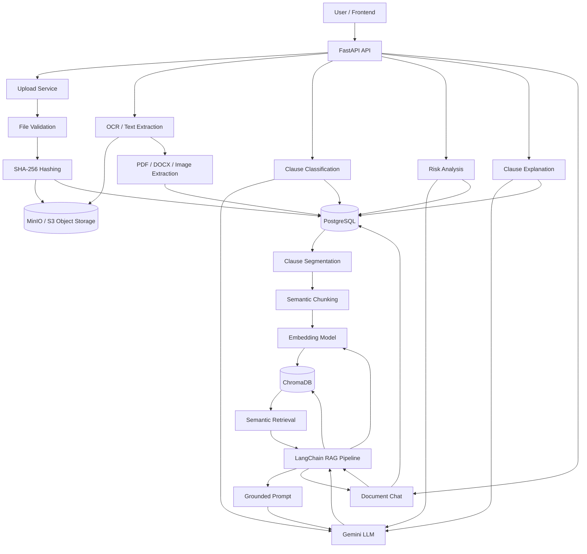

# Document Verification AI

> AI-powered legal document verification and intelligence platform using **RAG, semantic search, LangChain, embeddings, ChromaDB, and Gemini**.

Document Verification AI processes legal documents, extracts and structures their content, identifies legal clauses, classifies them, evaluates risk, generates explanations, and provides grounded question answering over the uploaded document.

The system follows a **Retrieval-Augmented Generation (RAG)** architecture so that the LLM answers questions using relevant clauses retrieved from the user's document rather than relying only on its pretrained knowledge.

---

## Table of Contents

- [Overview](#overview)
- [Architecture](#architecture)
- [RAG Architecture](#rag-architecture)
- [Semantic Search](#semantic-search)
- [Document Ingestion Pipeline](#document-ingestion-pipeline)
- [RAG Query Pipeline](#rag-query-pipeline)
- [LangChain Architecture](#langchain-architecture)
- [Vector Database](#vector-database)
- [Embedding Model](#embedding-model)
- [Chunking Strategy](#chunking-strategy)
- [Metadata and Filtering](#metadata-and-filtering)
- [Grounded Generation](#grounded-generation)
- [Citation Architecture](#citation-architecture)
- [Legal Document Analysis Pipeline](#legal-document-analysis-pipeline)
- [System Components](#system-components)
- [Database Design](#database-design)
- [Project Structure](#project-structure)
- [API Architecture](#api-architecture)
- [Technology Stack](#technology-stack)
- [Environment Variables](#environment-variables)
- [Running the Project](#running-the-project)
- [RAG Configuration](#rag-configuration)
- [Security and Reliability](#security-and-reliability)
- [Future Enhancements](#future-enhancements)

---

# Overview

The application is designed around a document-centric RAG workflow:

```text
Legal Document
      |
      v
Upload + Validation
      |
      v
Object Storage
      |
      v
OCR / Text Extraction
      |
      v
Legal Clause Segmentation
      |
      v
Semantic Chunking
      |
      v
Embedding Model
      |
      v
ChromaDB
      |
      v
Semantic Retrieval
      |
      v
LangChain RAG
      |
      v
Gemini LLM
      |
      v
Grounded Answer + Citations
```

The important principle is that the LLM is the **generation layer**, while the document and vector database provide the evidence used for the answer.

---

# Architecture



---

# RAG Architecture

The RAG pipeline contains two major stages:

```text
             INDEXING PHASE
                    |
                    v
Document -> Extract -> Chunk -> Embed -> ChromaDB

                    |
                    |
                    v

              QUERY PHASE
                    |
                    v
Question -> Embed -> Semantic Search -> Retrieve Context
                    |
                    v
              LangChain Prompt
                    |
                    v
                 Gemini
                    |
                    v
          Grounded Answer + Sources
```

## Why RAG?

A general-purpose LLM has broad pretrained knowledge, but it does not automatically know the contents of a private legal document uploaded by a user.

RAG solves this by retrieving relevant document content at query time:

```text
User Question
     |
     v
Semantic Retrieval
     |
     v
Relevant Legal Clauses
     |
     v
LLM Context
     |
     v
Answer based on document evidence
```

This also reduces hallucination because the model receives the relevant source material before generating the response.

---

# Semantic Search

The retrieval system uses **dense vector embeddings** instead of relying only on exact keyword matching.

For example:

```text
Query:
"Can the tenant end the lease before the expiry date?"

Document:
"The tenant may terminate this agreement prior to the expiration
of the contractual term by providing thirty days written notice."
```

Although the wording is different, the semantic meaning is closely related.

The embedding model converts both pieces of text into vectors:

```text
Query
  |
  v
Embedding Model
  |
  v
[0.12, -0.43, 0.71, ...]

Document Clause
  |
  v
Embedding Model
  |
  v
[0.10, -0.39, 0.69, ...]
```

The vector database then calculates similarity and retrieves the most relevant clauses.

### Retrieval flow

```text
Question
   |
   v
Query Embedding
   |
   v
ChromaDB Similarity Search
   |
   v
Top-K Relevant Clauses
   |
   v
Optional Reranking
   |
   v
Context for LLM
```

---

# Document Ingestion Pipeline

## 1. Upload

```text
POST /api/v1/documents/upload
```

The upload pipeline validates the document, generates a SHA-256 fingerprint, stores the raw file in MinIO/S3-compatible storage, and stores document metadata in PostgreSQL.

```text
User File
   |
   v
FastAPI
   |
   v
Validation
   |
   v
SHA-256
   |
   +-----------> PostgreSQL metadata
   |
   v
MinIO / S3
```

## 2. OCR / Text Extraction

Supported processing includes:

- PDF text extraction
- DOCX text extraction
- Image OCR
- Page and layout metadata

```text
Raw Document
     |
     v
OCR / Extraction
     |
     v
Normalized Text
```

## 3. Clause Segmentation

Legal documents should not be treated as one large text block.

The document is converted into structured legal clauses:

```text
Document
   |
   +-- Clause 1: Definitions
   |
   +-- Clause 2: Payment Terms
   |
   +-- Clause 3: Termination
   |
   +-- Clause 4: Liability
   |
   +-- Clause 5: Confidentiality
   |
   +-- ...
```

Each clause retains metadata such as:

```json
{
  "document_id": "document-123",
  "clause_id": "document-123-clause-0003",
  "heading": "Termination",
  "order_index": 3,
  "source_start": 4820,
  "source_end": 5370
}
```

This metadata is stored alongside the vector representation so retrieved context can always be traced back to the original legal clause.

---

# Chunking Strategy

Legal documents benefit from **structure-aware chunking** rather than blindly splitting every document at an arbitrary character count.

### Primary unit

```text
Legal Clause = Retrieval Unit
```

If a clause is small enough:

```text
Clause
  |
  v
One embedding
```

If a clause is very large:

```text
Long Clause
     |
     v
Recursive / Token Chunking
     |
     +--> Chunk 1
     +--> Chunk 2
     +--> Chunk 3
```

Each sub-chunk keeps the parent clause metadata:

```text
parent_clause_id
chunk_id
document_id
source_start
source_end
heading
```

This preserves legal context while keeping vectors within an appropriate semantic size.

---

# Embedding Model

The recommended local embedding model is:

```text
BAAI/bge-small-en-v1.5
```

It can run locally without requiring a paid embedding API.

Alternative models include:

```text
sentence-transformers/all-MiniLM-L6-v2
BAAI/bge-base-en-v1.5
```

### Embedding workflow

```text
Clause Text
    |
    v
HuggingFace / Sentence Transformers
    |
    v
Dense Embedding Vector
    |
    v
ChromaDB
```

The same embedding model must be used consistently for document indexing and query embedding.

---

# Vector Database

## ChromaDB

The architecture uses **ChromaDB** as the vector database because it is open-source and can run locally without a paid cloud service.

```text
Application
     |
     v
LangChain
     |
     v
ChromaDB
     |
     +--> Embeddings
     +--> Documents
     +--> Metadata
     +--> Similarity Search
```

Chroma can be run locally for development and can persist its collection to disk.

### Why ChromaDB?

- Open-source
- Free for local/self-hosted usage
- Easy Python integration
- Works directly with LangChain
- Supports metadata filtering
- Suitable for development and small-to-medium RAG applications
- Simple to replace with another vector database later

### Alternative: Pinecone

Pinecone can also be used as a managed vector database when a hosted architecture is preferred. If using Pinecone, select the currently available free/entry-level plan and verify its limits before deployment.

The application architecture remains the same:

```text
LangChain Retriever
       |
       +--> ChromaDB       # local/free
       |
       +--> Pinecone       # managed alternative
```

The rest of the RAG pipeline does not need to change.

---

# LangChain Architecture

LangChain is used as the orchestration layer connecting the individual RAG components.

```text
                  LangChain
                     |
       ┌─────────────┼─────────────┐
       |             |             |
       v             v             v
   Embeddings    Retriever      Prompt
       |             |             |
       v             v             v
   HuggingFace    ChromaDB      ChatPrompt
                     |
                     v
                 Documents
                     |
                     v
                  Gemini
```

## LangChain components

### 1. Document objects

```python
Document(
    page_content=clause_text,
    metadata={
        "document_id": document_id,
        "clause_id": clause_id,
        "heading": heading,
        "source_start": source_start,
        "source_end": source_end,
    },
)
```

### 2. Embeddings

```python
HuggingFaceEmbeddings
```

### 3. Vector store

```python
Chroma
```

### 4. Retriever

```python
retriever = vector_store.as_retriever(
    search_type="similarity",
    search_kwargs={"k": 5}
)
```

### 5. Prompt template

```python
ChatPromptTemplate
```

### 6. LLM

```text
Gemini
```

### 7. RAG chain

```text
Retriever
    |
    v
Relevant Documents
    |
    v
Prompt Template
    |
    v
Gemini
    |
    v
Answer
```

---

# RAG Query Pipeline

When a user asks a question about a document:

```text
                  User Question
                        |
                        v
                 FastAPI Chat API
                        |
                        v
                LangChain RAG Chain
                        |
                        v
                 Query Embedding
                        |
                        v
                    ChromaDB
                        |
                        v
                 Similarity Search
                        |
                        v
                    Top-K Chunks
                        |
                        v
                 Metadata Filter
                        |
                        v
                  Optional Reranker
                        |
                        v
                  Context Builder
                        |
                        v
                  Prompt Template
                        |
                        v
                    Gemini LLM
                        |
                        v
              Grounded Answer
                        |
                        v
                Source Citations
```

---

# Metadata and Filtering

For a document-specific chatbot, retrieval must be restricted to the requested document.

For example:

```text
User asks:
"What are the termination conditions?"

Current document:
document_id = abc123
```

The vector search should apply:

```text
metadata.document_id == "abc123"
```

This prevents retrieval from accidentally returning clauses belonging to another user's document.

Recommended metadata:

```json
{
  "document_id": "abc123",
  "clause_id": "abc123-clause-0007",
  "heading": "Termination",
  "order_index": 7,
  "source_start": 8400,
  "source_end": 9100,
  "document_sha256": "..."
}
```

---

# Reranking

For higher-quality legal retrieval, a reranking stage can be inserted after the initial vector search.

```text
Query
  |
  v
ChromaDB
  |
  v
Top 10 semantic candidates
  |
  v
Reranker
  |
  v
Top 3-5 relevant clauses
  |
  v
Gemini
```

This is useful when several legal clauses have similar semantic meanings but only a few directly answer the question.

The initial retrieval provides high recall, while reranking improves precision.

---

# Grounded Generation

The LLM should never be instructed to answer from general knowledge when the question is about the uploaded document.

A grounded prompt should follow this structure:

```text
SYSTEM
You are a legal document assistant.

Answer the user's question using ONLY the supplied document context.
Do not invent clauses, dates, parties, obligations, or facts.
If the retrieved context does not contain enough information,
state that the document does not provide sufficient information.

USER QUESTION
{question}

RETRIEVED DOCUMENT CONTEXT
{context}

RESPONSE REQUIREMENTS
- Answer clearly and directly.
- Base every material claim on retrieved context.
- Cite the supporting clause.
- Do not fabricate citations.
- Express uncertainty when evidence is insufficient.
```

### Grounding principle

```text
Retrieved Evidence
       |
       v
     Gemini
       |
       v
Evidence-based Answer
```

The LLM generates the answer; it does not become the source of truth.

---

# Citation Architecture

Legal document answers should be traceable to the original source.

Each retrieved chunk should contain:

```text
clause_id
source_start
source_end
quoted_text
```

The response can therefore return:

```json
{
  "answer": "The tenant may terminate the agreement by providing 30 days written notice.",
  "confidence": 0.91,
  "citations": [
    {
      "clause_id": "document-123-clause-0003",
      "source_span_start": 4820,
      "source_span_end": 5370,
      "quoted_text": "The tenant may terminate..."
    }
  ]
}
```

### Citation validation

Before returning an answer:

```text
LLM Citation
     |
     v
Is clause_id in retrieved documents?
     |
   ┌─┴─┐
  YES  NO
   |    |
   v    v
Return  Reject / regenerate
```

This prevents hallucinated clause references.

---

# Legal Document Analysis Pipeline

The RAG system works together with the document-analysis modules:

```text
                         Legal Document
                               |
                               v
                         OCR / Parsing
                               |
                               v
                       Clause Segmentation
                               |
                ┌──────────────┼──────────────┐
                |              |              |
                v              v              v
         Classification     Risk Scoring    Semantic Index
                |              |              |
                v              v              v
             Gemini         Gemini         ChromaDB
                |              |              |
                └──────────────┼──────────────┘
                               |
                               v
                         Document Chat
                               |
                               v
                         LangChain RAG
                               |
                               v
                             Gemini
                               |
                               v
                     Grounded Legal Answer
```

---

# System Components

| Component | Responsibility |
|---|---|
| **FastAPI** | REST API and request handling |
| **PostgreSQL** | Document metadata, clauses, classifications, risks, explanations, chat history |
| **MinIO** | Raw document/object storage |
| **OCR / Parser** | Extract text and layout information |
| **Clause Segmenter** | Convert legal text into structured clauses |
| **LangChain** | RAG orchestration |
| **HuggingFace Embeddings** | Convert text/questions into dense vectors |
| **ChromaDB** | Store vectors and perform semantic retrieval |
| **Gemini** | Classification, risk analysis, explanations, and grounded generation |
| **Optional Reranker** | Improve retrieval precision |

---

# Database Design

## PostgreSQL

PostgreSQL is the transactional system of record.

```text
Documents
   |
   +-- OCR Results
   |
   +-- Clauses
          |
          +-- Classifications
          |
          +-- Risks
          |
          +-- Explanations
   |
   +-- Chat Messages
```

### Documents

```text
id
original_filename
stored_filename
mime_type
extension
storage_uri
object_key
file_size
sha256
status
created_at
updated_at
```

### Clauses

```text
id
document_id
clause_id
order_index
heading
text
source_start
source_end
created_at
updated_at
```

The vector database does not replace PostgreSQL. It is a retrieval index over the textual content.

---

# Project Structure

```text
Document-Verification-AI/
│
├── backend/
│   ├── app/
│   │   ├── api/
│   │   │   ├── upload.py
│   │   │   ├── ocr.py
│   │   │   ├── clauses.py
│   │   │   ├── classification.py
│   │   │   ├── risk.py
│   │   │   ├── explanation.py
│   │   │   └── chat.py
│   │   │
│   │   ├── config/
│   │   ├── database/
│   │   ├── models/
│   │   ├── repositories/
│   │   ├── schemas/
│   │   │
│   │   ├── services/
│   │   │   ├── upload_service.py
│   │   │   ├── ocr_service.py
│   │   │   ├── clause_service.py
│   │   │   ├── clause_segmenter.py
│   │   │   ├── embedding_service.py
│   │   │   ├── classification_service.py
│   │   │   ├── risk_service.py
│   │   │   ├── explanation_service.py
│   │   │   └── rag_service.py
│   │   │
│   │   └── storage/
│   │       └── storage_service.py
│   │
│   ├── Dockerfile
│   └── alembic.ini
│
├── frontend/
├── pyproject.toml
└── README.md
```

For the semantic RAG layer, the service boundary can be organized as:

```text
services/
│
├── embedding_service.py
├── vector_store_service.py
├── retrieval_service.py
├── reranker_service.py
└── rag_service.py
```

This keeps embedding, retrieval, and generation concerns separate.

---

# API Architecture

## Document APIs

```http
POST /api/v1/documents/upload
POST /api/v1/documents/{document_id}/ocr
GET  /api/v1/documents/{document_id}/ocr/status
GET  /api/v1/documents/{document_id}/ocr
```

## Clause APIs

```http
POST /api/v1/documents/{document_id}/clauses/segment
GET  /api/v1/documents/{document_id}/clauses
GET  /api/v1/documents/{document_id}/clauses/{clause_id}
```

## Analysis APIs

```http
POST /api/v1/documents/{document_id}/classify
POST /api/v1/documents/{document_id}/score-risk
POST /api/v1/documents/{document_id}/explain
GET  /api/v1/documents/{document_id}/readability-report
```

## RAG Chat APIs

```http
POST /api/v1/documents/{document_id}/chat
GET  /api/v1/documents/{document_id}/chat-history
```

### Chat request

```json
{
  "query": "What are the termination conditions?",
  "top_k": 5
}
```

### Chat response

```json
{
  "answer": "The agreement allows termination under...",
  "confidence": 0.91,
  "citations": [
    {
      "clause_id": "document-123-clause-0003",
      "source_span_start": 4820,
      "source_span_end": 5370,
      "quoted_text": "..."
    }
  ]
}
```

---

# Technology Stack

| Layer | Technology |
|---|---|
| Backend | FastAPI |
| Language | Python |
| Database | PostgreSQL |
| ORM | SQLAlchemy |
| Migrations | Alembic |
| Object Storage | MinIO / S3-compatible storage |
| RAG Framework | LangChain |
| Embeddings | HuggingFace / Sentence Transformers |
| Embedding Model | BGE / MiniLM |
| Vector Database | ChromaDB |
| LLM | Google Gemini |
| PDF Processing | pypdf |
| Validation | Pydantic |
| Server | Uvicorn |
| Containerization | Docker |
| Package Management | Poetry |

---

# Environment Variables

```env
APP_NAME=Legal Document Intelligence
APP_VERSION=1.0.0
ENVIRONMENT=development

DATABASE_HOST=localhost
DATABASE_PORT=5432
DATABASE_NAME=legal_ai
DATABASE_USER=postgres
DATABASE_PASSWORD=postgres

STORAGE_ENDPOINT=http://localhost:9000
STORAGE_ACCESS_KEY=legal_admin
STORAGE_SECRET_KEY=change-this-password
STORAGE_BUCKET=legal-documents
STORAGE_REGION=us-east-1

MAX_UPLOAD_SIZE_MB=50
LOG_LEVEL=INFO

GEMINI_API_KEY=your_gemini_api_key
GEMINI_MODEL=your_gemini_model
GEMINI_CLASSIFICATION_BATCH_SIZE=100

# RAG
EMBEDDING_MODEL=BAAI/bge-small-en-v1.5
CHROMA_PERSIST_DIRECTORY=./data/chroma
CHROMA_COLLECTION_NAME=legal_clauses
RAG_TOP_K=5
RERANK_TOP_K=3
SIMILARITY_THRESHOLD=0.50
```

---

# Running the Project

## 1. Clone the repository

```bash
git clone https://github.com/animeshkarmakar7/Document-Verification-AI.git
cd Document-Verification-AI
```

## 2. Install dependencies

```bash
poetry install
```

## 3. Start PostgreSQL

Create the configured database:

```text
legal_ai
```

## 4. Start MinIO

Run MinIO locally and expose its S3-compatible endpoint at:

```text
http://localhost:9000
```

## 5. Initialize the database

```bash
alembic upgrade head
```

## 6. Start FastAPI

```bash
uvicorn app.main:app --reload --port 8000
```

The API will be available at:

```text
http://127.0.0.1:8000
```

Swagger documentation:

```text
http://127.0.0.1:8000/docs
```

---

# RAG Configuration

The RAG pipeline can be configured as:

```text
Embedding Model
       |
       v
BAAI/bge-small-en-v1.5
       |
       v
ChromaDB
       |
       v
Similarity Search
       |
       v
Top 5 chunks
       |
       v
Optional Reranking
       |
       v
Top 3 chunks
       |
       v
ChatPromptTemplate
       |
       v
Gemini
```

### Recommended retrieval defaults

```text
Initial retrieval: top 5-10
Reranked context: 3-5
Temperature: low
Document filter: current document_id
```

The exact values should be evaluated against a legal-question test set rather than treated as universal constants.

---

# Security and Reliability

Legal documents can contain sensitive information, so the architecture should enforce:

### Document isolation

Every vector search should filter by:

```text
document_id
```

### Source grounding

The LLM should only answer from retrieved context for document-specific questions.

### Citation validation

Every citation returned by the model should be checked against retrieved chunks.

### Confidence handling

If retrieval quality is below the configured threshold:

```text
Do not confidently answer.
Return an insufficient-evidence response.
```

### Secrets

API keys, database passwords, and object-storage credentials must be provided through environment variables or a secret manager.

### Auditability

Persist:

```text
query
retrieved clause IDs
retrieval scores
model name/version
answer
citations
confidence
timestamp
```

This makes generated legal analysis traceable and auditable.

---

# Future Enhancements

- Hybrid semantic + keyword retrieval
- Cross-encoder reranking
- Query rewriting for legal questions
- Multi-query retrieval
- Parent-document retrieval
- Cross-document comparison
- Contract contradiction detection
- Table-aware retrieval
- Better scanned-PDF OCR
- Retrieval evaluation with Recall@K, MRR and nDCG
- Citation correctness evaluation
- Answer groundedness evaluation
- Background processing for large documents
- Authentication and authorization
- Rate limiting
- Observability and tracing

---

# Complete RAG Architecture Summary

```text
                              USER
                                |
                                v
                         ┌─────────────┐
                         │   FastAPI   │
                         └──────┬──────┘
                                |
               ┌────────────────┼────────────────┐
               |                |                |
               v                v                v
          Upload/OCR        Analysis          Chat
               |                |                |
               v                v                v
          PostgreSQL         Gemini       LangChain RAG
               |                               |
               v                               v
       Clause Segmentation              Query Embedding
               |                               |
               v                               v
        Semantic Chunking                 ChromaDB
               |                               |
               v                               v
        Embedding Model                  Top-K Retrieval
               |                               |
               v                               v
           ChromaDB                       Reranker
                                               |
                                               v
                                         Retrieved Context
                                               |
                                               v
                                        ChatPromptTemplate
                                               |
                                               v
                                            Gemini
                                               |
                                               v
                                    Grounded Answer
                                               |
                                               v
                                    Citation Validation
                                               |
                                               v
                                           Response
```

### Core architecture

```text
FastAPI
   |
   +-- PostgreSQL       -> application state
   |
   +-- MinIO            -> raw documents
   |
   +-- LangChain        -> RAG orchestration
   |
   +-- Embeddings       -> semantic representation
   |
   +-- ChromaDB         -> vector retrieval
   |
   +-- Gemini           -> grounded generation
```

This architecture provides a complete **semantic-search RAG pipeline** for legal document question answering while keeping document storage, transactional data, vector retrieval, orchestration, and LLM generation as separate responsibilities.
