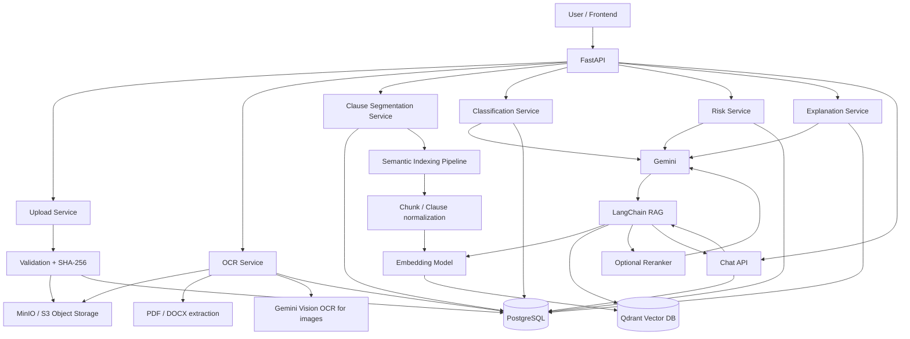

# Document Verification AI

> AI-powered legal document intelligence, verification, clause analysis, risk scoring, explanation, and grounded document chat.

Document Verification AI is a backend-oriented legal document analysis system built around **FastAPI, PostgreSQL, MinIO-compatible object storage, Google Gemini, OCR/text extraction, clause segmentation, classification, risk analysis, explanation generation, and document-grounded chat**.

The repository currently implements a clause-aware retrieval layer using lexical token vectors and cosine similarity. The recommended next step is to evolve that layer into a production-grade **semantic-search RAG pipeline using LangChain + a free/self-hosted vector database such as Qdrant**, while continuing to use PostgreSQL as the transactional system of record.

---

## Table of Contents

- [What the Project Does](#what-the-project-does)
- [Current Implementation](#current-implementation)
- [Recommended Semantic RAG Architecture](#recommended-semantic-rag-architecture)
- [Architecture Diagram](#architecture-diagram)
- [End-to-End Data Flow](#end-to-end-data-flow)
- [Why Semantic Search](#why-semantic-search)
- [LangChain RAG Design](#langchain-rag-design)
- [Vector Database Strategy](#vector-database-strategy)
- [Document Processing Pipeline](#document-processing-pipeline)
- [Legal Intelligence Pipeline](#legal-intelligence-pipeline)
- [Grounded Chat and Citations](#grounded-chat-and-citations)
- [Project Structure](#project-structure)
- [Database and Storage Responsibilities](#database-and-storage-responsibilities)
- [API Surface](#api-surface)
- [Technology Stack](#technology-stack)
- [Local Development](#local-development)
- [Environment Variables](#environment-variables)
- [Recommended RAG Upgrade](#recommended-rag-upgrade)
- [Current vs Target Architecture](#current-vs-target-architecture)
- [Limitations and Engineering Notes](#limitations-and-engineering-notes)
- [Future Improvements](#future-improvements)

---

## What the Project Does

The system is designed to take a legal document from upload through analysis and finally provide grounded answers about the document.

### Core capabilities

1. **Document ingestion**
   - Accept supported document/image formats.
   - Validate uploads.
   - Calculate SHA-256 for document identity and duplicate detection.
   - Store raw documents in MinIO-compatible object storage.
   - Persist document metadata in PostgreSQL.

2. **Text extraction / OCR**
   - Extract text from PDFs with `pypdf`.
   - Extract text from DOCX files.
   - Use Gemini vision input for image OCR.
   - Persist extracted text and page/layout metadata.

3. **Legal clause segmentation**
   - Split OCR text into structured legal clauses.
   - Preserve clause IDs, order, headings, and source character spans.
   - Store clauses in PostgreSQL.

4. **Clause classification**
   - Classify clauses into legal categories using Gemini.
   - Persist classification results and model version.

5. **Risk scoring**
   - Evaluate clauses for risk level, risk score, reason, flags, and suggested mitigation.
   - Aggregate clause-level risk into a document-level risk dashboard.

6. **Clause explanation**
   - Generate explanations and readability information for legal text.

7. **Document-grounded chat**
   - Retrieve relevant clauses for a user query.
   - Generate an answer from retrieved document context.
   - Return confidence and clause-level citations.
   - Store chat history in PostgreSQL.

---

# Current Implementation

The repository is already structured as a layered FastAPI application. The main application registers upload, OCR, clause segmentation, classification, risk, explanation, and chat routers under `/api/v1`. fileciteturn5file0

### Current request path

```text
Client
  |
  v
FastAPI
  |
  +--> Upload API
  +--> OCR API
  +--> Clause API
  +--> Classification API
  +--> Risk API
  +--> Explanation API
  +--> Chat API
            |
            v
        Service Layer
            |
            +--> Repositories --> PostgreSQL
            +--> Storage Service --> MinIO / S3-compatible storage
            +--> Gemini API
```

The upload service validates the file, computes a SHA-256 hash, checks for duplicate documents, uploads the raw file to object storage, and persists metadata in PostgreSQL. fileciteturn9file0 fileciteturn14file0

The storage abstraction uses the S3 API through `boto3`, but is configured to point to a local/object-storage endpoint. The default configuration therefore fits MinIO or another S3-compatible service. fileciteturn22file0 fileciteturn18file0

---

# Important RAG Architecture Note

The current repository **does not yet use a true embedding model or vector database**.

The current `ClauseEmbeddingService` tokenizes the query and clause text, builds a term-frequency vector over a vocabulary, and ranks clauses with cosine similarity. This is a lightweight lexical-vector retrieval method, not transformer-based semantic retrieval. fileciteturn8file0

The current chat service then passes the retrieved clauses to Gemini using a prompt that instructs the model to stay grounded in those clauses and return structured citations. fileciteturn7file0

So the existing implementation is closer to:

```text
Query
  -> lexical vectorization
  -> cosine similarity over stored clauses
  -> top-k clauses
  -> Gemini grounded generation
```

The recommended architecture described below upgrades that retrieval layer to:

```text
Query
  -> embedding model
  -> semantic vector search
  -> optional metadata filtering
  -> optional reranking
  -> LangChain retrieval chain
  -> LLM grounded generation
  -> cited answer
```

This distinction is intentional: the README documents both **what exists today** and **what the production RAG architecture should become**.

---

# Recommended Semantic-Search RAG Architecture

## Target architecture

```text
                           ┌─────────────────────────┐
                           │       Client / UI        │
                           └────────────┬────────────┘
                                        │
                                        ▼
                           ┌─────────────────────────┐
                           │        FastAPI           │
                           │      API Gateway         │
                           └────────────┬────────────┘
                                        │
                ┌───────────────────────┼────────────────────────┐
                │                       │                        │
                ▼                       ▼                        ▼
       ┌────────────────┐     ┌──────────────────┐      ┌─────────────────┐
       │ Document APIs  │     │ Analysis APIs    │      │ Chat API        │
       │ Upload / OCR   │     │ Classify / Risk  │      │ RAG / History   │
       │ Clauses        │     │ Explain          │      │                 │
       └───────┬────────┘     └────────┬─────────┘      └────────┬────────┘
               │                       │                         │
               ▼                       ▼                         ▼
       ┌────────────────┐     ┌──────────────────┐      ┌─────────────────┐
       │ Service Layer  │     │ Service Layer    │      │ LangChain RAG   │
       └───────┬────────┘     └────────┬─────────┘      └────────┬────────┘
               │                       │                         │
       ┌───────┴──────────────┐        │                 ┌───────┴──────────┐
       │                      │        │                 │                  │
       ▼                      ▼        ▼                 ▼                  ▼
┌─────────────┐      ┌───────────────────┐     ┌───────────────┐   ┌───────────────┐
│ MinIO / S3  │      │ PostgreSQL        │     │ Embedding     │   │ Qdrant        │
│ Raw files   │      │ Metadata +        │     │ Model         │   │ Vector Store  │
│             │      │ analysis results  │     │ BGE / MiniLM  │   │ semantic top-k │
└─────────────┘      └───────────────────┘     └───────┬───────┘   └───────┬───────┘
                                                       │                   │
                                                       └────────┬──────────┘
                                                                │
                                                                ▼
                                                        ┌───────────────┐
                                                        │ Optional      │
                                                        │ Reranker      │
                                                        └───────┬───────┘
                                                                │
                                                                ▼
                                                        ┌───────────────┐
                                                        │ Gemini / LLM  │
                                                        │ grounded      │
                                                        │ generation    │
                                                        └───────────────┘
```

### Design principle

Keep the responsibilities separate:

- **MinIO** stores the original binary documents.
- **PostgreSQL** stores transactional metadata and application results.
- **Qdrant** stores semantic vectors and retrieval metadata.
- **Embedding model** converts clauses/chunks and queries into dense vectors.
- **LangChain** orchestrates document loading, splitting, embeddings, retrieval, prompts, and generation.
- **Gemini** produces the final grounded answer and can continue to power classification/risk/explanation tasks.

This prevents the vector store from becoming the system of record for legal application state.

---

# Architecture Diagram



---

# End-to-End Data Flow

## 1. Upload

```text
POST /api/v1/documents/upload
```

The upload service:

1. Validates file type and size.
2. Calculates SHA-256.
3. Checks whether the same file was previously uploaded.
4. Creates a document ID.
5. Uploads the raw object to MinIO.
6. Stores document metadata in PostgreSQL.

The repository explicitly uses SHA-256 as a unique document fingerprint and returns the existing document for duplicate content. fileciteturn14file0

---

## 2. OCR / Text Extraction

```text
POST /api/v1/documents/{document_id}/ocr
```

Current extraction logic supports:

- PDF text extraction through `pypdf`.
- DOCX XML extraction.
- Image OCR through Gemini multimodal input.

The OCR service persists both extracted text and layout/page metadata. fileciteturn10file0 fileciteturn13file0

For scanned PDFs, the current PDF path intentionally fails when no text is extracted and indicates that image-based OCR is required. fileciteturn13file0

---

## 3. Clause Segmentation

```text
POST /api/v1/documents/{document_id}/clauses/segment
```

The system converts OCR text into structured clauses.

Each clause stores:

```text
clause_id
order_index
heading
text
source_start
source_end
document_id
```

Those source spans are especially important for RAG because they allow the answer to reference the original document location instead of returning an unsupported free-form response. fileciteturn24file0

---

# Semantic Indexing Pipeline

The recommended semantic-search pipeline should begin after clause segmentation.

```text
OCR text
   |
   v
Clause segmentation
   |
   v
Structured clauses
   |
   +--> metadata
   |      - document_id
   |      - clause_id
   |      - heading
   |      - order_index
   |      - source_start
   |      - source_end
   |
   v
LangChain Document objects
   |
   v
Text normalization / chunking
   |
   v
Embedding model
   |
   v
Qdrant collection
```

For legal documents, the existing clause segmentation is a strong retrieval boundary. Rather than blindly splitting every document into fixed 500-token chunks, use the legal clause as the primary unit and only sub-chunk very long clauses.

### Recommended chunking strategy

```text
Clause length <= threshold
    -> store one vector

Clause length > threshold
    -> split into overlapping sub-chunks
    -> preserve parent clause_id
    -> preserve source offsets
```

This retains legal structure while preventing long clauses from becoming overly broad retrieval units.

---

# Why Semantic Search

The current lexical retrieval can work when the query and clause share the same vocabulary. However, legal questions are often phrased differently from the source document.

For example:

```text
User query:
"Can the tenant terminate the agreement early?"

Document wording:
"Either party may elect to bring this lease to an end prior to the expiration date..."
```

A lexical word-overlap method can miss this relationship because `terminate` and `bring this lease to an end` are different expressions.

Dense semantic embeddings map both texts into a vector space where meaning, rather than exact token overlap, drives retrieval.

### Recommended embedding options

For a free/local implementation:

- `BAAI/bge-small-en-v1.5` — lighter and suitable for local development.
- `BAAI/bge-base-en-v1.5` — stronger general quality with higher resource usage.
- `sentence-transformers/all-MiniLM-L6-v2` — very lightweight baseline.

For a legal-document project, benchmark the candidate embeddings on your actual queries instead of assuming the largest model is automatically best.

---

# LangChain RAG Design

LangChain should be used as the orchestration layer, not as the database itself.

## Ingestion side

```python
Document / Clause
      |
      v
LangChain Document
      |
      v
Text splitter
      |
      v
Embeddings
      |
      v
Qdrant
```

Each vector record should include metadata such as:

```json
{
  "document_id": "...",
  "clause_id": "...",
  "heading": "Termination",
  "order_index": 12,
  "source_start": 4820,
  "source_end": 5370,
  "document_sha256": "..."
}
```

## Query side

```text
User question
    |
    v
Query embedding
    |
    v
Qdrant similarity search
    |
    v
Top-k candidate chunks
    |
    v
Metadata filtering
    |
    v
Optional reranking
    |
    v
Prompt template
    |
    v
Gemini / LLM
    |
    v
Grounded structured answer + citations
```

---

# Recommended LangChain Components

A clean implementation can use:

```text
langchain-core
langchain-community
langchain-qdrant
sentence-transformers
qdrant-client
```

Conceptually:

```python
embedding_model = HuggingFaceEmbeddings(...)
vector_store = QdrantVectorStore(...)
retriever = vector_store.as_retriever(
    search_type="similarity",
    search_kwargs={"k": 5}
)
```

The exact package/API choices should be pinned to the LangChain version used by the project, because LangChain's package split has changed over time.

---

# RAG Prompt Architecture

The generation prompt should explicitly separate **instructions**, **question**, and **retrieved evidence**.

Example conceptual prompt:

```text
SYSTEM
You are a legal document assistant.
Answer only from the supplied document context.
Do not invent facts, clauses, dates, parties, or legal conclusions.
If the evidence is insufficient, say that the document does not provide
sufficient information.

USER QUESTION
{question}

DOCUMENT CONTEXT
{context}

RESPONSE REQUIREMENTS
- Answer directly.
- Cite every material claim.
- Identify the clause_id for supporting evidence.
- Preserve the distinction between document facts and interpretation.
- Return low confidence when evidence is weak.
```

This follows the grounding principle already present in the existing `RAGService`, which instructs Gemini to answer only from retrieved clauses and return structured citations. fileciteturn7file0

---

# Grounded Chat and Citations

The existing chat API already exposes:

```text
POST /api/v1/documents/{document_id}/chat
GET  /api/v1/documents/{document_id}/chat-history
```

The chat response contains:

```text
answer
citations
confidence
created_at
```

and citations are represented using:

```text
clause_id
source_span_start
source_span_end
quoted_text
```

This is a valuable design choice because legal answers should be traceable back to the source text. fileciteturn6file0 fileciteturn7file0

### Recommended citation flow

```text
Qdrant result
   |
   +--> clause_id
   +--> source_start
   +--> source_end
   +--> text
   |
   v
Prompt context
   |
   v
LLM answer
   |
   v
Citation validator
   |
   v
API response
```

A stronger production implementation should validate that every returned citation corresponds to one of the retrieved source chunks instead of trusting the LLM to invent valid citation IDs.

---

# Legal Intelligence Pipeline

RAG chat is only one part of the project.

The broader analysis pipeline is:

```text
                    Document
                       |
                       v
                 OCR / Extraction
                       |
                       v
              Clause Segmentation
                       |
             ┌─────────┴─────────┐
             │                   │
             v                   v
        Classification       Semantic Index
             │                   │
             v                   v
         Risk Scoring        Qdrant
             │                   │
             v                   v
        Explanations         RAG Chat
             │                   │
             └─────────┬─────────┘
                       v
                 Legal Insights
```

The classification service batches clauses and sends them to Gemini, then persists category and model-version information. fileciteturn15file0

The risk service combines clause text with classification output and persists risk level, score, reasoning, flag type, and mitigation suggestions. It also computes a document-level risk score and category breakdown. fileciteturn16file0

The explanation API provides clause/document explanations and readability reporting. fileciteturn17file0

---

# Project Structure

A simplified view of the repository is:

```text
Document-Verification-AI/
│
├── backend/
│   ├── app/
│   │   ├── api/
│   │   │   ├── upload.py
│   │   │   ├── ocr.py
│   │   │   ├── clauses.py
│   │   │   ├── classification.py
│   │   │   ├── risk.py
│   │   │   ├── explanation.py
│   │   │   └── chat.py
│   │   │
│   │   ├── config/
│   │   │   └── settings.py
│   │   │
│   │   ├── core/
│   │   │   ├── errors.py
│   │   │   └── logging.py
│   │   │
│   │   ├── database/
│   │   │   ├── base.py
│   │   │   └── database.py
│   │   │
│   │   ├── models/
│   │   │   ├── document.py
│   │   │   ├── clause.py
│   │   │   ├── classification.py
│   │   │   ├── risk.py
│   │   │   ├── explanation.py
│   │   │   └── chat.py
│   │   │
│   │   ├── repositories/
│   │   │   └── ...
│   │   │
│   │   ├── schemas/
│   │   │   └── ...
│   │   │
│   │   ├── services/
│   │   │   ├── upload_service.py
│   │   │   ├── ocr_service.py
│   │   │   ├── ocr_extractor.py
│   │   │   ├── clause_service.py
│   │   │   ├── clause_segmenter.py
│   │   │   ├── embedding_service.py
│   │   │   ├── classification_service.py
│   │   │   ├── risk_service.py
│   │   │   ├── explanation_service.py
│   │   │   └── rag_service.py
│   │   │
│   │   └── storage/
│   │       └── storage_service.py
│   │
│   ├── alembic.ini
│   └── Dockerfile
│
├── frontend/
├── pyproject.toml
└── GenAI_Legal_Document_Demystifier_Blueprint.pdf
```

---

# Database and Storage Responsibilities

## PostgreSQL

Use PostgreSQL for structured application state:

```text
Documents
OCR results
Clauses
Classifications
Risk assessments
Explanations
Chat messages
Migration metadata
```

The project already models documents and clauses relationally, including foreign keys and source spans. fileciteturn23file0 fileciteturn24file0

## MinIO / S3-compatible storage

Use object storage for:

```text
original PDFs
DOCX files
uploaded images
other raw binary artifacts
```

The current storage service uses the S3 API through `boto3` and keeps the bucket/object key separate from PostgreSQL metadata. fileciteturn22file0

## Qdrant

Use Qdrant only for retrieval-oriented vector data:

```text
embedding
chunk text or reference
metadata filters
vector similarity index
```

Do not move core document lifecycle state into Qdrant.

---

# API Surface

The application exposes the following logical endpoint groups:

| Area | Example endpoint | Purpose |
|---|---|---|
| Upload | `POST /api/v1/documents/upload` | Upload and register a document |
| OCR | `POST /api/v1/documents/{id}/ocr` | Extract document text |
| OCR status | `GET /api/v1/documents/{id}/ocr/status` | Check OCR state |
| Clauses | `POST /api/v1/documents/{id}/clauses/segment` | Segment legal clauses |
| Clauses | `GET /api/v1/documents/{id}/clauses` | List clauses |
| Classification | `/api/v1/.../classification...` | Classify clauses |
| Risk | `/api/v1/.../risk...` | Score legal risk |
| Explanation | `POST /api/v1/documents/{id}/explain` | Generate explanations |
| Chat | `POST /api/v1/documents/{id}/chat` | Ask questions about a document |
| Chat history | `GET /api/v1/documents/{id}/chat-history` | Retrieve conversation history |

The exact router registration is defined in `app/main.py`. fileciteturn5file0

---

# Technology Stack

## Current repository

| Layer | Technology |
|---|---|
| API | FastAPI |
| Server | Uvicorn |
| Language | Python 3.14+ |
| ORM | SQLAlchemy 2 |
| Database | PostgreSQL |
| Migrations | Alembic |
| Object storage | MinIO / S3-compatible storage |
| File uploads | `python-multipart` |
| PDF extraction | `pypdf` |
| LLM / multimodal AI | Google Gemini via `google-genai` |
| Validation | Pydantic / pydantic-settings |
| UI dependency | Streamlit |
| Containerization | Docker |
| Package management | Poetry |

The current `pyproject.toml` contains the above runtime dependencies and does not currently include LangChain or a vector database client. fileciteturn20file0

## Recommended RAG stack

| Component | Recommended technology |
|---|---|
| Orchestration | LangChain |
| Embeddings | BGE / Sentence Transformers |
| Vector DB | Qdrant (self-hosted/free) |
| LLM | Gemini or another supported chat model |
| Metadata | PostgreSQL |
| Raw files | MinIO |
| API | FastAPI |

---

# Local Development

The project is packaged with Poetry and also includes a Dockerfile that installs Poetry dependencies, runs Alembic migrations, and starts Uvicorn. fileciteturn19file0

## 1. Clone

```bash
git clone https://github.com/animeshkarmakar7/Document-Verification-AI.git
cd Document-Verification-AI
```

## 2. Install dependencies

```bash
poetry install
```

## 3. Configure environment

Copy:

```text
backend/.env.example
```

to:

```text
backend/.env
```

and configure PostgreSQL, MinIO/S3-compatible storage, and Gemini.

## 4. Start the API

From the backend context:

```bash
uvicorn app.main:app --reload --port 8000
```

## 5. Docker

The repository Dockerfile is designed to run Alembic migrations and then start:

```text
uvicorn app.main:app --host 0.0.0.0 --port 8000
```

You still need reachable PostgreSQL, object storage, and Gemini configuration for the full application path. fileciteturn19file0

---

# Environment Variables

Current settings include:

```env
APP_NAME=Legal Document Intelligence
APP_VERSION=1.0.0
ENVIRONMENT=development

DATABASE_HOST=localhost
DATABASE_PORT=5432
DATABASE_NAME=legal_ai
DATABASE_USER=postgres
DATABASE_PASSWORD=postgres

STORAGE_ENDPOINT=http://localhost:9000
STORAGE_ACCESS_KEY=legal_admin
STORAGE_SECRET_KEY=change-this-password
STORAGE_BUCKET=legal-documents
STORAGE_REGION=us-east-1

MAX_UPLOAD_SIZE_MB=50
LOG_LEVEL=INFO

GEMINI_API_KEY=
GEMINI_MODEL=gemini-3.6-flash
GEMINI_CLASSIFICATION_BATCH_SIZE=100
```

These are defaults from the current application settings; production deployments should use secret management and non-default credentials. fileciteturn18file0

---

# Recommended RAG Upgrade

The highest-value engineering change is to replace the current lexical retrieval component with an actual semantic index.

## Step 1 — Add embeddings

Create an embedding service:

```text
Clause text
   -> Sentence Transformer / BGE
   -> dense vector
```

## Step 2 — Add Qdrant

Create one collection such as:

```text
legal_clauses
```

with vector metadata:

```text
document_id
clause_id
heading
order_index
source_start
source_end
```

## Step 3 — Index clauses

After segmentation:

```text
ClauseSegmentationService
      |
      v
SemanticIndexService
      |
      v
LangChain Document
      |
      v
Embedding Model
      |
      v
Qdrant
```

The PostgreSQL clause record remains the canonical source. Qdrant stores the retrieval representation.

## Step 4 — Replace current search service

Current:

```python
ClauseEmbeddingService.search_similar_clauses(...)
```

Target:

```python
retriever.invoke(query)
```

where the retriever is backed by Qdrant.

## Step 5 — Add metadata filtering

Chat should retrieve only from the requested document:

```text
filter: document_id == current_document_id
```

This is critical. Without document-level filtering, a multi-document vector collection could return clauses from unrelated documents.

## Step 6 — Add optional reranking

For high-accuracy legal retrieval:

```text
Qdrant top 10
   -> reranker
   -> top 3-5
   -> LLM
```

A reranker is especially helpful when multiple clauses have related legal vocabulary but only one directly answers the query.

## Step 7 — Add retrieval evaluation

Measure retrieval separately from generation.

Useful metrics include:

```text
Recall@k
Precision@k
MRR
nDCG
Answer groundedness
Citation accuracy
Abstention accuracy
```

This lets you determine whether failures come from retrieval or from the LLM.

---

# Current vs Target Architecture

| Capability | Current repository | Recommended target |
|---|---|---|
| API | FastAPI | FastAPI |
| Database | PostgreSQL | PostgreSQL |
| Raw documents | MinIO/S3 | MinIO/S3 |
| OCR | pypdf/DOCX + Gemini image OCR | Same + stronger scanned-PDF OCR path |
| Clause segmentation | Rule/structure-based | Same, with long-clause sub-chunking |
| Retrieval | Token-frequency vectors + cosine | Dense transformer embeddings |
| Vector DB | None | Qdrant |
| RAG framework | Custom Python service | LangChain orchestration |
| LLM | Gemini | Gemini or interchangeable chat model |
| Citations | Clause IDs + source spans | Validated retrieved-source citations |
| Chat history | PostgreSQL | PostgreSQL |
| Filtering | Document fetched before search | Vector metadata filter by document ID |
| Reranking | None | Optional cross-encoder/reranker |
| Evaluation | No dedicated retrieval eval layer found | Retrieval + grounding evaluation |

---

# Limitations and Engineering Notes

## 1. Current retrieval is not semantic embedding search

This is the most important architectural limitation. The current retrieval code uses token counts and cosine similarity rather than transformer embeddings. fileciteturn8file0

## 2. No vector database is currently configured

The current dependency file has no Qdrant, Chroma, FAISS, or LangChain dependency. fileciteturn20file0

## 3. RAG generation is currently custom-coded

The `RAGService` constructs context manually and calls the Gemini SDK directly. This works, but LangChain would provide reusable abstractions for retrievers, prompt templates, document objects, chains, and vector stores. fileciteturn7file0

## 4. Retrieval threshold requires empirical tuning

The current service uses a fixed similarity threshold of `0.15`. That threshold has meaning only relative to the current scoring system; it should not be carried over to a new embedding space without evaluation. fileciteturn7file0

## 5. Citation output should be validated

The current LLM is asked to return citation objects, but production systems should verify that each citation points to a retrieved source chunk before returning it to the client.

## 6. Scanned-PDF handling can be improved

The current PDF extractor uses direct text extraction and explicitly reports failure when the PDF contains no extractable text. A production pipeline should detect scanned PDFs and route them to OCR automatically. fileciteturn13file0

## 7. Default credentials must not be used in production

The repository settings contain development defaults for PostgreSQL and object storage. These should be replaced through environment configuration and secret management. fileciteturn18file0

## 8. The LLM is not a source of truth

The LLM should remain the synthesis layer. PostgreSQL/MinIO/Qdrant and the original source document provide the evidence. The model should never be treated as authoritative legal truth.

---

# Future Improvements

### RAG quality

- Add transformer embeddings.
- Add Qdrant metadata filtering.
- Add hybrid lexical + semantic retrieval.
- Add reranking.
- Add retrieval evaluation datasets.
- Add citation verification.
- Add answer abstention tests.

### Document intelligence

- Automatic scanned-PDF detection.
- Better layout-aware OCR.
- Table extraction.
- Signature and stamp detection.
- Document type detection before analysis.
- Cross-document comparison.
- Clause-to-clause contradiction detection.

### Production engineering

- Background jobs for expensive OCR/LLM workflows.
- Async task queue such as Celery/RQ/Arq.
- Caching for repeated analysis.
- Observability and tracing.
- Model/version tracking.
- Rate limiting and authentication.
- Automated integration tests.
- Retrieval and generation regression tests.

### Legal safety

- Explicit uncertainty handling.
- Source-first answer policies.
- Clear separation between document interpretation and legal advice.
- Human review workflow for high-risk documents.
- Immutable audit trail for generated assessments.

---

# Architecture Summary

The project should be understood as a **legal document intelligence platform** rather than only a chatbot.

Its strongest architectural pattern is:

```text
          INGESTION
              |
              v
      Raw Document Storage
              |
              v
         OCR / Parsing
              |
              v
      Clause Segmentation
              |
      ┌───────┼────────┐
      │       │        │
      v       v        v
 Classification Risk  Semantic Index
      │       │        │
      │       │        v
      │       │      Qdrant
      │       │        │
      └───────┴────────┤
                       v
                  LangChain RAG
                       |
                       v
                     Gemini
                       |
                       v
             Grounded Answer + Citation
```

The key architectural upgrade is therefore **not replacing the whole system**. It is replacing the current custom lexical retrieval layer with a properly evaluated semantic retrieval stack while preserving the existing document model, clause IDs, source spans, PostgreSQL persistence, object storage, and FastAPI service boundaries.

That gives the project a much stronger and more defensible RAG architecture for legal document question answering.
